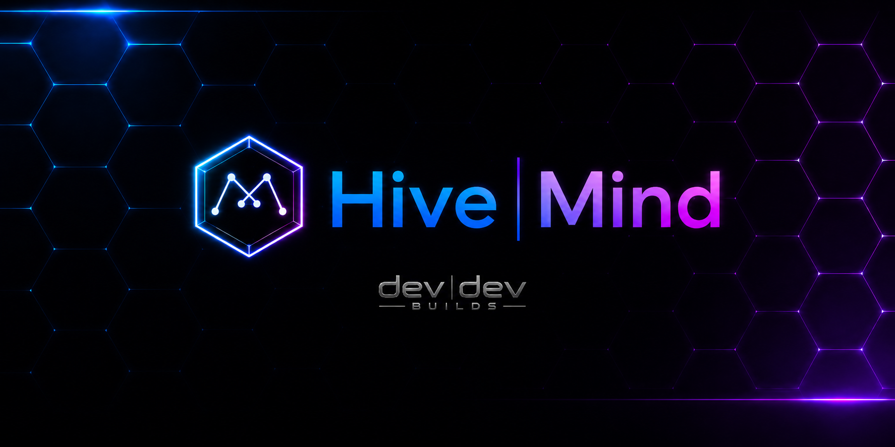
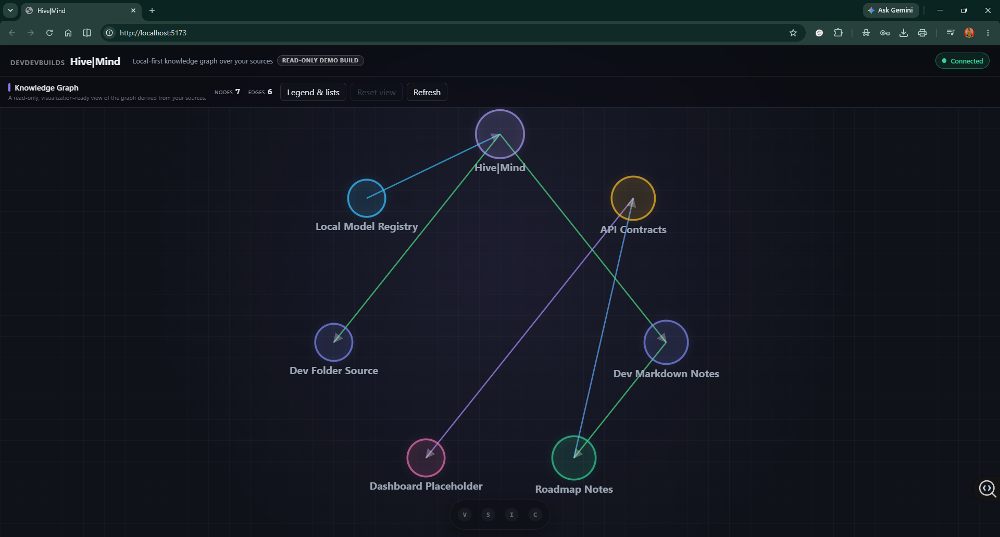
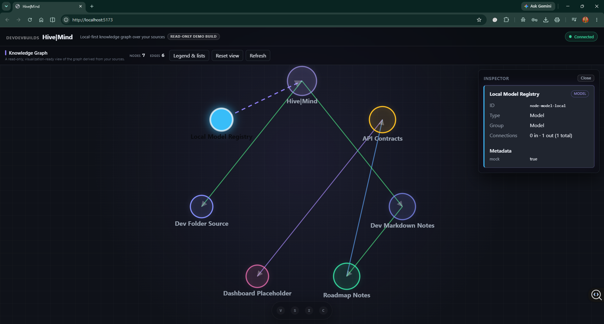
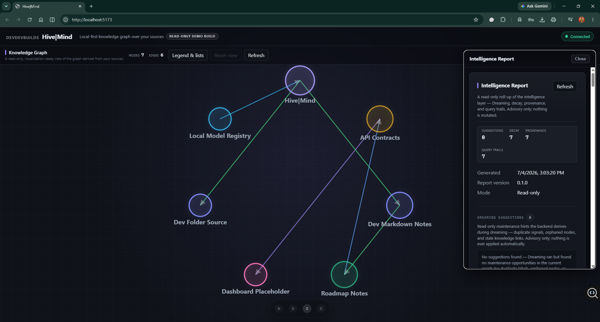

<!-- markdownlint-disable MD041 -->



# Hive|Mind

Parent label: **devdevbuilds**

## Overview

Hive|Mind is a **local-first, graph-primary AI memory / intelligence workspace
for developers**. It connects knowledge sources — starting with Obsidian vault
content — into a normalized backend data model and presents that model with the
**Knowledge Graph as the primary application surface**: the graph fills the
viewport edge-to-edge like a viewfinder over an intelligence map, and the
supporting tools — the Source Registry, the Obsidian import workflow, the query
Console, and the Intelligence Report (Temporal Decay, Dreaming Suggestions,
Provenance Chains, and Query Trails, all backend-derived and read-only) —
appear as contextual overlays summoned over the graph rather than as permanent
dashboard columns.

The UI direction is dark, serious, and premium: a black/chrome/metal dev-tool
shell in which the shell chrome carries almost no color, and the visual energy
is concentrated in the graph itself — nodes, edges, groups, idle aura,
selection pulse. Hive|Mind is deliberately **not dashboard-first, not
card-grid-first, and not a SaaS sidebar shell**; there is no persistent sidebar
as the default pattern.

It is built to improve everyday development work — organization, data provenance,
workflow speed, knowledge consistency, source tracking, and development
coordination — on top of a human-reviewed agent workflow and safer project memory
and reasoning surfaces. It is also a deliberately scoped backend/cybersecurity
portfolio project, and the two goals reinforce each other: the discipline that
makes it a credible portfolio piece (deterministic logic, read-only surfaces,
honest scope) is the same discipline that makes it a trustworthy tool.

> **What it is, in one line:** Hive|Mind is a local-first, graph-primary
> knowledge intelligence workspace that organizes imported knowledge sources,
> presents them as a full-surface knowledge graph, and derives deterministic,
> read-only intelligence signals — temporal decay, dreaming suggestions,
> provenance chains, and query trails — from existing structure rather than
> from any AI/LLM call.

The conceptual model is deliberately simple:

- **Obsidian** is the human writing and thinking layer, where notes, links, and
  ideas are authored.
- **Hive|Mind** is the layer above it: the registry, normalization, graph, and
  analysis surface that turns that writing into structured, queryable knowledge.

Obsidian is where you think; Hive|Mind is where that thinking becomes a graph you
can inspect and, over time, reason about.

**Agent-assisted, human-reviewed.** Hive|Mind's development is agent-assisted but
human-reviewed. Agents may propose structure, documentation, implementation, or
analysis; **devdevbuilds remains the human decision-maker and merge gate.** The
project intentionally relies on deterministic backend logic and read-only
intelligence surfaces *before* any mutation or automation — agents help draft,
humans decide what ships.

## Visual evidence

These are real captures of the running app — the local frontend (`5173`)
talking to the local backend (`8787`), not mockups. They were taken during the
Phase 28C QA pass on the **true graph-primary surface** shipped in Phase 28B,
so they show the current connected state. Three views tell the whole story:

**1. The graph-primary surface** — the graph *is* the app.



The Knowledge Graph fills the viewport edge-to-edge on the dark black/chrome
shell. The masthead and the compact bottom dock are floating translucent
overlays — there is no persistent sidebar, no dashboard columns, and no
card-grid framing. Color energy lives in the nodes and edges, not the chrome.

**2. Selection + inspector** — contextual, not permanent.



Selecting a node summons a floating glass inspector card over the graph — the
selected node glows, edges incident to it pick up the energy-flow dash
treatment, and the detail view appears only when asked for. The graph stays
read-only throughout.

**3. Intelligence overlay** — the differentiator, summoned in context.



The four backend-derived, read-only Intelligence sections (Temporal Decay,
Dreaming Suggestions, Provenance Chains, Query Trails) open as a contextual
overlay above the graph rather than a permanent dashboard section. This is
deterministic rule-based derivation over the store — **no AI/LLM** — which is
what makes it auditable.

> The Vault, Sources, Console, legend/lists, and narrow-viewport captures from
> the same session are kept in
> [`docs/demo/screenshots/`](docs/demo/screenshots/), and the capture session is
> documented in the
> [Phase 28C True Graph-Primary Surface QA + Screenshot Evidence](docs/demo/phase-28c-true-graph-primary-surface-qa-screenshot-evidence.md)
> note. The Phase 29B interaction polish (hover lifts, three-tier selection
> emphasis, edge selection, overlay behavior) is captured in the
> `phase-29c-connected-*` set, documented in the
> [Phase 29C Graph Interaction + Overlay Polish QA + Screenshot Evidence](docs/demo/phase-29c-graph-interaction-overlay-polish-qa-screenshot-evidence.md)
> note, and the newest **Phase 30B interaction-recovery + responsive-rail fixes**
> (dock-close focus recovery, the press-for-press Escape stack, and the
> contained narrow-viewport rail) are captured in the `phase-30c-connected-*`
> set, documented in the
> [Phase 30C Interaction Recovery QA + Screenshot Evidence](docs/demo/phase-30c-interaction-recovery-qa-screenshot-evidence.md)
> note. The current **2.5D Spatial Hive** surface — the Phase 33C spatial-depth
> foundation (PR #131) hardened by Phase 33D (PR #132), with visible near/mid/far
> depth tiers, a near-tier selected-node lift, and reduced-motion compatibility —
> is captured in the `phase-33e-spatial-hive-*` set, documented in the
> [Phase 33E 2.5D Spatial Hive QA + Screenshot Evidence](docs/demo/phase-33e-2-5d-spatial-hive-qa-screenshot-evidence.md)
> note. The earlier dashboard-era `phase-23b-*` / `phase-25c-*` capture sets are
> preserved in `docs/demo/screenshots/` as history.

## Current status

The project has moved beyond the initial foundation. The original Phase 1 app
shell is complete and has been built on through local JSON-backed backend
storage, the Hive Console, the Source Registry, the Obsidian import pipeline,
the Knowledge Graph API, and the read-only Knowledge Graph panel with its custom
SVG visualization.

- **Current phase:**
  `Phase 36J - Full-Hand Spatial Tracking + Gesture Control Foundation`
  (**frontend-only implementation**). Webcam graph control now derives from
  the full 21-landmark MediaPipe hand set instead of primarily the sparse
  wrist / thumb-tip / index-tip triangle. A new pure module
  `handSpatialTracking.ts` extracts a typed `HandSpatialFeatures` object per
  frame: palm center / width / height, normalized hand scale, a palm
  coordinate frame (longitudinal + lateral axes and approximate palm normal,
  built from the wrist and four MCP knuckles via Gram-Schmidt +
  cross-product so it stays stable while individual fingers bend),
  yaw/pitch/roll estimates, deterministic per-finger
  `extended | partial | curled | unknown` states (tip projection along the
  palm's longitudinal axis — rotation-invariant, not raw screen y),
  continuous 0..1 openness, and pinch geometry normalized identically to the
  preserved 0.40 / 0.52 thresholds. Degenerate or non-finite landmark
  geometry collapses to an explicit `valid: false` sentinel, so `NaN` /
  `Infinity` cannot reach the control pipeline. A deterministic tracker
  layer adds wrap-aware step-bounded EMA smoothing, finger-state debounce,
  per-frame translation/expansion deltas, and a full reset after 250 ms of
  detection loss. A minimal typed gesture foundation
  (`gestureRecognition.ts`) separates raw pose observations from confirmed
  gestures (hold-to-confirm + switch debounce, held-duration + stability)
  and recognizes **open palm / fist / pointing** as derived display states —
  pinch stays owned by the existing pinch-gate pipeline, and no new graph
  actions were added. The externally consumed `MotionCommand` contract is
  unchanged and all downstream consumers are untouched: yaw/pitch still map
  from the 5-point palm centroid, zoom now reads the aspect-compensated hand
  scale (steadier under hand tilt; same 0.22 neutral), pinch behavior is
  preserved. The Motion Sandbox gains a concise **Spatial tracking** readout
  (gesture candidate, palm yaw/pitch/roll, openness, hand scale, five
  finger-state chips, validity) plus faint smoothed palm-axis overlay lines
  under the existing skeleton. A dependency-free Node self-test
  (`node apps/frontend/src/handSpatialTracking.selftest.ts`, 400+ assertions
  over synthetic fixtures: open / fist / pointing / pinch, rotated,
  mirrored, tiny-scale, overlapping/degenerate, missing landmarks, loss +
  smoothing reset, no-NaN walks) passes, and `npm run check:frontend`
  passes. **Honest status:** this is a tracking-foundation implementation
  validated with synthetic fixtures and a non-camera browser smoke test
  only — **live human-camera tuning is still required**, the broader gesture
  library remains future work, and **screenshot / evidence capture remains
  deferred**. Recommended next: a live-camera validation + conservative
  gesture-tuning pass over the new thresholds.

- **Active track — Agent Intelligence Infrastructure (Track 2):**
  `Phase 37B - Active Memory Contract Types / Schema Alignment`
  (**contracts only**). Phase 37A (planning) is **complete**; Phase 37B defines
  the stable backend (Pydantic, `apps/backend/app/models/active_memory.py`) and
  frontend (TypeScript, `apps/frontend/src/types/api.ts`) **wire contracts** for
  the future memory layer: memory records with structured claims, evidence records
  with bounded references, the separate `verification` and `lifecycle` state axes,
  source identity without a trust flag, forward-only supersession/retraction
  references, contradiction records (the five Phase 37D MVP classes), an explicit
  active-state result enum, and a read-only context-packet response — versioned
  `active-memory.v1` with byte-for-byte frontend/backend enum parity. **No
  persistence, store, API endpoint, ingestion, contradiction execution,
  active-state calculation, context-packet generation, or UI exists yet**, and no
  dependency was added; **Phase 37C — Deterministic Memory Store MVP** is next.
  This track is **parallel to and independent of** the spatial-interaction track
  above — **Phase 36K remains paused (not completed)**, and live gesture tuning is
  **not** claimed complete. See the
  [Phase 37A planning doc](docs/planning/phase-37a-active-agent-memory-verification-layer-planning.md)
  and the reusable [Active Agent Memory + Verification Layer reference](docs/active-agent-memory-verification-layer.md)
  (§11 records the settled 37B contract decisions).

  The preceding **Phase 36I - Elastic Spatial Hive Live Interaction QA +
  Tuning** (**frontend-only**). A focused live-interaction QA and defensive pass over
  the Phase 36H elastic system — not a feature-expansion phase: no new
  gestures, no dependency / backend / API / schema / persistence change, and
  the read-only graph-data contract is preserved. **Verified live** against a
  connected runtime (live backend, the real 7-node graph): pointer orbit with
  continuous wrapped yaw + the preserved pitch clamp + live depth/occlusion
  reorder; drag-release momentum that coasts and settles; a hub-node grab that
  follows the pointer under the soft cap while direct neighbors follow
  attenuated, the two-hop node moves less, and unrelated nodes stay still —
  edges stretch and stay attached, transforms stay finite (no NaN); full
  recovery to the deterministic home cloud on release; double-click recenter;
  and intact click-select + inspector with a clean console. **One defect
  fixed:** a window blur / focus-steal *mid-gesture* delivered no `pointerup` /
  `pointercancel`, so the in-flight press was never cleared — and because the
  surface accepts one gesture at a time, that wedged all further pointer input
  and froze a held grab. A window `blur` handler (`cancelActiveGesture`) now
  ends the interrupted gesture as a throw-less release (drops the gesture,
  recovers the deformation — snapping home under reduced motion — releases
  pointer capture, and clears the click-suppression flag); verified
  deterministically (gesture clears on blur, a fresh gesture is accepted
  immediately after). **No tuning constants were changed** — the existing
  gains/thresholds/damping carry live-tested rationale (Phases 32H / 36E /
  36F) and this QA exposed no feel defect to justify moving one. **Motion /
  webcam:** the pointer↔motion arbitration was *structurally inspected* only;
  live webcam hand-motion feel was **not tested and remains unverified**.
  `npm run check:frontend` (tsc + vite build) passes; browser smoke testing
  passes; no console errors/warnings introduced. **Screenshot / evidence
  capture remains deferred.** (Phase 36J was subsequently scoped to the
  full-hand tracking foundation above rather than the screenshot refresh this
  phase suggested; the evidence pass is still pending.)

  The preceding **Phase 36H - Elastic Spatial Hive Manipulation**
  (**frontend-only implementation**) implements the Phase 36G contract: the
  Spatial Hive is now a *handled* object. **Infinite orbit:** the yaw clamps
  (drag ±42°, total ±58°) are gone — dragging spins the structure endlessly
  in either direction, with the accumulated angle wrap-normalized into
  [-180°, 180°) so precision never degrades (seamless across the wrap; the
  projector feeds yaw straight into cos/sin). Pitch stays clamped at the
  existing bounds (drag ±26°, total ±36°) so the structure never flips and
  labels never invert — deliberately **no quaternion, arcball, or free-roll
  orientation**. Releasing a fast drag hands off to **rotational momentum**:
  release velocity is estimated from recent pointer movement, speed-capped,
  and damped by a deterministic frame-rate-aware exponential decay that snaps
  to exact zero (pitch clamps and yaw wraps throughout the coast; pressing
  the surface stops it instantly). **Elastic node-pull:** dragging a node
  past the existing 4px click threshold grabs it — the node tracks the
  pointer in its own depth plane (screen delta unscaled by its perspective
  scale, inverse-rotated through the pose), soft-capped via tanh so no pull
  can fling a node off-screen. Displacement propagates along *real* edges by
  a closed-form model in the new pure module `spatialHiveElasticity.ts`:
  `displacement(node) = grabbedDisplacement × hopWeight × recoveryFactor`,
  with BFS hop weights 1 / 0.45 / 0.18 and exactly 0 beyond two hops
  (adjacency built once per graph change, influence map once per grab — never
  per frame), so pulling a node visibly tugs its relationship neighborhood
  and nothing else; edges and particle shells ride the displaced anchors.
  Release decays every displacement exponentially back to exact zero;
  re-grabbing mid-recovery folds the in-flight offsets into a residual field
  so nothing snaps. Chosen over a force simulation because it is
  deterministic (same graph + grab + pointer path → same deformation),
  bounded, O(affected nodes) per frame, and dependency-free — no physics
  engine, no D3 force, no solver, no per-node velocity state. **Input
  arbitration:** a single `SpatialInteractionOwner` (node-grab >
  graph-pointer > reset > motion-control > none) pauses motion-camera deltas
  during any pointer gesture and resumes them cleanly afterward (the existing
  stale-command guard prevents resume jumps); the opt-in default-off motion
  behavior is unchanged. Recenter and double-click reset now also zero
  momentum and all elastic state. **Reduced motion:** no driver loop, sway,
  parallax, momentum, overshoot, or animated recovery — but direct
  manipulation stays usable: drag-to-reorient and node-pull work
  position-coupled (event-driven rendering) and release snaps home
  instantly. Everything is presentation-only: graph data, edges, sources,
  and the deterministic home coordinates are never mutated, nothing is
  persisted, and the connected-runtime smoke test confirmed the console
  stays clean with only GET requests during every gesture.
  `npm run check:frontend` passes. **Screenshot / evidence capture remains
  deferred**, and live human hand-motion feel is still untested.

  The preceding **Phase 36G - Elastic Spatial Hive Manipulation Planning**
  (**planning / documentation only, no implementation**). Defines the
  implementation contract for making the Spatial Hive a *handled* object,
  in two parts. **Infinite/freeform orbit:** the recommended path is wrapped
  (unbounded, wrap-normalized) **yaw with clamped pitch** — endless horizontal
  spin like turning a globe, chosen over arcball / free-roll alternatives
  because the pitch clamp keeps the structure from ever flipping and keeps
  billboard labels readable, while the existing projector already handles any
  yaw value (the current ±58° bound is a composition policy, not a math
  limit). **Elastic node-pull:** a new pure, deterministic,
  presentation-only deformation layer (working name `spatialHiveElastic.ts`)
  holding a transient per-node displacement field — the grabbed node follows
  the pointer (eased, capped), direct neighbors follow at 0.35–0.55 strength,
  second-degree neighbors at 0.12–0.25, unrelated nodes stay still, with
  weights computed once per grab by BFS over the *real* edge list so the
  deformation visualizes actual relationships; release eases everything back
  to exactly zero. Explicitly **not** a physics simulation: no force solver,
  no D3, no physics engine, no new dependency, no persistence — closed-form
  displacement math, cleared by release / Esc / Recenter / reload. The
  [planning doc](docs/planning/phase-36g-elastic-spatial-hive-manipulation-planning.md)
  separates the three layers (read-only source graph data / deterministic
  Phase 36F spatial projection / new transient elastic interaction) and
  specifies interaction rules (click still selects; drag-from-empty still
  orbits; drag-from-node becomes pull; pull never selects or mutates),
  reduced-motion behavior, motion-tracking compatibility (pinch-grab maps
  onto the same abstract grab/pull/release contract later), acceptance
  criteria, and rollback. Graph and source data remain strictly read-only;
  **screenshot / evidence capture stays deferred** until the
  post-implementation surface settles. Docs-only: no frontend, backend, API,
  schema, package, dependency, or persistence change.

  The preceding **Phase 36F - Spatial Hive Point-Cloud Graph Manipulation
  + Living Hive Preservation Pass** (**frontend-only**). The Knowledge Graph
  now renders on a **pseudo-3D spatial point-cloud foundation**: every node
  receives stable spatial coordinates (x, y, z) derived deterministically from
  the existing layout + node identity/degree (`spatialHiveProjection.ts` — no
  runtime randomness, no fake data), each cluster gains a deterministic,
  hash-seeded dust shell drawn on a canvas behind the SVG
  (`spatialHiveParticles.ts`, globally capped), and a perspective projector
  maps nodes, edges, and particles through the camera pose per frame. The
  Phase 32G orbital camera no longer tilts the whole layer as a flat poster —
  yaw/pitch/zoom re-project every element individually, so near and far
  objects move differently and manipulation produces true parallax. The depth
  field is deliberately deep (~2.2× near-to-far perspective scale at rest,
  with node depths **rank-stratified** so the cloud always spans the full
  front-to-back range), node **render order is depth-sorted per frame**
  (painter's algorithm on the live projected depth, so orbiting visibly
  changes occlusion), and projected depth drives per-node **fog and
  depth-of-field blur** (emphasised nodes always resolve sharp). Three
  always-available cursor inputs make the structure directly manipulable
  without a webcam: **drag-to-orbit** (grab and spin the structure, ±42°/±26°,
  persistent until Recenter or an empty-space double-click; a drag never
  commits the click it releases on, so selection stays untouched), **cursor
  parallax** (bounded ±16°/±11°, eased), and a slow deterministic **ambient
  sway** (±10°/±5° over ~26s/19s sine periods) that keeps a whisper of
  parallax alive at rest so depth is visible before any input. All three
  compose with the opt-in motion camera under a total-orbit clamp and are
  disabled under reduced motion. Edges are **spatial synapses**: depth-aware
  fog opacity and a depth-scaled stroke-width ladder that preserves the
  base < incident/hovered < selected weight hierarchy exactly. The living Hive system is preserved, not replaced — breathing
  nodes, pulsing selected halo, related-node aura tier, hover-primary clarity,
  far/mid/near tiers (now computed from the same shared depth unit as the
  projection), depth fog/veil atmosphere, interaction modes, reduced-motion
  stillness (static depth structure, zero movement), read-only interactions,
  inspector, and billboard-readable labels all ride the projected positions.
  No backend / API / schema / package / persistence change; no WebGL, no
  Three.js, no physics — perspective-projected SVG + canvas only.

  The preceding **Phase 36F - Live Camera Test + Tuning Validation**
  (**validation-only, no code changes**) ran the live-camera
  validation session that Phases 36D/36E prepared for, against a real Chrome
  149 browser on the dev machine. **Live-validated:** the `HD Pro Webcam C920`
  starts cleanly through the Motion Sandbox's real getUserMedia flow (640×480,
  live track, active in ~2s), the MediaPipe hand landmarker loads on the GPU
  delegate and reaches **MediaPipe ready**, Stop Camera genuinely releases the
  device (track `ended`, srcObject cleared) and an immediate restart works
  (cached detector, no re-download), graph control is confirmed **off by
  default** with the Graph link cue flipping Linked/Off correctly, the graph
  camera transform holds *exactly* neutral with no hand in frame (no drift
  over multi-second sampling with control enabled), and Recenter resets the
  pose. The earlier "camera hardware unavailable" blocker is resolved: the
  faulty device is a separate `PC Camera` (driver Error state); the C920
  reports OK and works. **Not validated (honestly):** no human hand was
  in front of the camera during the session, so overlay readability under
  real hand motion, pinch engage/release feel (the 0.40/0.52 hysteresis),
  palm-centroid steadiness, range hints, and live graph yaw/pitch/zoom feel
  remain unverified — and because no live behavior demonstrated a defect, **no
  tuning constants were changed** (per the phase's smallest-change rule).
  Console stayed clean apart from two known-benign MediaPipe wasm info/warn
  lines and a pre-existing `/favicon.ico` 404 (no icon link in `index.html`;
  out of 36F scope). **Screenshot / evidence capture remains deferred** until
  a human-in-frame session confirms control feel.

  The preceding **Phase 36E - Gesture Tracking Super-Tuning + Control Feel
  Readiness** (**frontend-only**) was a diagnostic-readability and
  conservative-tuning pass that prepared the Motion Sandbox for a serious live
  camera validation session. Three bounded tuning/readability changes: (1) the
  raw pinch gains **ratio hysteresis** — it engages below 0.40 (unchanged) but
  now releases only above 0.52, so a thumb/index gap hovering at the old single
  threshold can no longer strobe the pinch gate's hold/release timers (the
  temporal debounce itself is unchanged); (2) the overlay's **palm-centroid
  marker is display-smoothed** (EMA, display-only — command math untouched) and
  redrawn as an amber crosshair ring, so the one point that actually drives
  yaw/pitch is visually distinct from the cyan diagnostic skeleton and its
  jitter is no longer misread as tracking jitter; (3) the **pinch line now has
  three states** — dashed cyan open, brighter dashed green while the raw pinch
  registers and the hold timer arms, solid green once held — so a tester can
  watch the debounce work. New diagnostics for live evaluation: a numeric
  **Gesture diagnostics** card (pinch ratio, palm span, mirrored palm x/y, hand
  span, each annotated with the threshold it is judged against) and a **Graph
  link** cue pill making the opt-in graph-control state visible beside the
  other live cues. Tuning constants gained live-tuning guidance comments.
  The `MotionCommand` contract, opt-in/off-by-default graph control, Phase 36C
  reduced-motion behavior, the Phase 36D full-hand overlay layering, and the
  no-camera / no-hand idle states are all preserved; `orbitalGraphControl.ts`
  is deliberately untouched (its deadzone/gains were tuned against live feel in
  Phase 32H — re-tuning them without a camera would be unjustified). Live
  webcam hand tracking remained untested at the close of 36E (camera startup
  was then live-validated in 36F; hand-motion feel is still pending) and the
  **screenshot / evidence refresh remains deferred**.
  `npm run check:frontend` passes.

  The preceding **Phase 36D - Full Hand Landmark Overlay + Gesture
  Tracking Readability** (**frontend-only**) upgraded the Motion
  Sandbox's hand-tracking overlay from a single-purpose debug sketch into a
  full-hand landmark diagnostic: all 21 MediaPipe hand landmarks now render as
  small faint cyan dots joined by thin translucent skeleton lines, so it is
  obvious whether the whole hand is tracking cleanly (jitter, dropped joints,
  partial detection) rather than only the pinch points. The active control
  geometry stays visually strongest — thumb and index tips draw brighter and
  larger (green while a debounced pinch is held), a thumb↔index gesture line
  shows the gap the pinch ratio measures (dashed while open, solid green while
  held), and subtle hollow rings mark the wrist joint and the derived palm
  centroid that yaw/pitch actually track. The overlay is purely visual: the
  `MotionCommand` contract, gesture/command pipeline, opt-in graph control,
  and Phase 36C reduced-motion behavior are unchanged, and the no-camera /
  no-hand idle states behave exactly as before. **Live webcam hand tracking
  remains untested** (camera hardware still unavailable) and the
  **screenshot / evidence refresh remains deferred**. `npm run check:frontend`
  passes.

  The preceding **Phase 36C - Spatial Hive 2.5D Render + Tracking
  Manipulation QA / Hardening** (**frontend-only**) validated —
  through live in-browser behavior checks, not screenshot capture — that the
  Spatial Hive renders as a believable 2.5D layered surface and that the
  opt-in tracking/motion control manipulates it safely. Render QA confirmed:
  near/mid/far tiers stay visually distinct (scale 1.14/1.0/0.87, opacity
  1/0.9/0.74, aerial blur/desaturation ramp), labels stay readable in every
  tier, the selected node remains the strongest visual priority (scale 1.2,
  brightest w800 halo label, pulsing aura, deepest atmosphere), incident edges
  stay fully lit under a tight bloom, and the atmosphere/veil/aura layers
  preserve rather than flatten depth at desktop and narrow viewports. Tracking
  QA confirmed: motion control is opt-in and off by default, enabling it
  mutates no graph data or node geometry, the idle/no-hand camera holds a
  drift-free neutral pose, Recenter snaps back to face-on, and a selection
  outranks — and stays fully readable during — motion-armed state. One
  hardening gap was found and fixed in `KnowledgeGraphPanel.tsx`: the OS
  reduced-motion preference is now tracked live via a `matchMedia` change
  listener, so enabling it mid-session halts the camera loop and reports
  "Reduced motion" honestly (previously the preference was only re-read on the
  next toggle, and flipping it back could replay a stale accumulated pose).
  `MotionSandboxPanel.tsx`, `orbitalGraphControl.ts`, `handLandmarkMotion.ts`,
  and `styles.css` needed no changes and are untouched. **Live webcam hand
  tracking was NOT tested** (no working camera hardware); the motion pipeline
  was validated to its fail-safe boundaries without a live hand, and yaw/pitch/
  zoom live feel remains unverified. The **screenshot / evidence refresh
  remains deferred** to a later phase. `npm run check:frontend` passes.

  The preceding **Spatial Hive final micro-polish / screenshot-readiness
  pass** (**frontend-only, CSS micro-polish**) was the last visual-preparation
  step before evidence capture — four tiny tunings of existing systems, no new
  visual system: the node-label dark halo densifies fractionally (0.72 → 0.78)
  so glyph contrast holds constant over the 36A/36B fog fields and auras; the
  resting far-tier blur eases (0.4px → 0.3px) so far labels resolve crisper in
  stills; the atmosphere veil's peripheral corner ring eases (0.4 → 0.36) so
  viewport corners stay readable under the deepest (selection) fog; and a
  hovered node at rest lifts clear of the resting depth fade/blur with a
  one-step label brighten — hooked on the existing hover-primary class, which
  never applies to selected/related nodes.

  The preceding **Phase 36B - Spatial Hive Energy Field UX Hardening /
  Visual Balance Pass** (**frontend-only, CSS visual-balance pass**)
  tunes the Phase 36A atmosphere in place — no new visual system — so the
  Spatial Hive reads premium, layered, calm, and graph-legible: the idle veil
  quiets (0.6 → 0.52) while staying dimensional; the hover delta narrows so
  pointer entry reads as attention, not a lighting flicker; selection
  compression eases (0.88 → 0.78) so peripheral fog no longer competes with
  related/far labels near the frame edge while **selection remains the
  unambiguous strongest state** (hover 0.44 < idle 0.52 < motion 0.6 <
  selected 0.78); the veil's clear core widens so fog stays off the populated
  middle band; the canvas centre glow eases and the deep-space floor falloff
  starts later and lands lighter so corner-region nodes stay legible; far-tier
  aerial muting is bounded a step tighter (it had stacked with the veil,
  making far labels pay twice for one distance cue) with near/mid/far ordering
  intact; and the selected-incident-edge bloom tightens to a denser, narrower
  halo. Reduced-motion behavior is preserved unchanged, nothing animated is
  added, `KnowledgeGraphPanel.tsx` is untouched, motion control remains
  opt-in, and the **screenshot / evidence refresh stays deferred** to a later
  phase (live webcam hand-motion evidence is still not claimed — it requires
  separate verification on working camera hardware).

  The preceding **Phase 36A - Spatial Hive Energy Field / Depth-Atmosphere
  Frontend Pass** (**frontend-only, CSS-led**) added a presentation-only
  energy-field / depth-atmosphere layer around the existing 2.5D Spatial Hive so
  the graph reads as suspended inside a deep, pressurized black/chrome space —
  spatial and alive, not decorated. Three coordinated pieces, all riding existing
  state: (1) an **ambient depth floor** — the dark graph-canvas background gains
  a deep-space falloff beneath the nodes so the plotting grid recedes at the
  edges while nodes stay lit; (2) an **atmosphere veil** — a single `::after`
  pseudo-element on the canvas wrap (zero markup, zero React change) lays
  edge-weighted fog over the field, driven through one opacity dial by the
  existing Phase 35B/35C interaction attributes: hover gently thins the fog
  (the field opens toward exploration), motion-armed holds fractionally more
  pressure than idle, and an active selection **compresses the field** — the
  periphery deepens so the lit selected neighbourhood reads as the pressurized
  centre of a local energy field, while every established selected / related /
  dimmed rule is untouched and selection stays the strongest state; edges
  incident to the selection additionally carry a soft static identity-violet
  bloom so connections into the selected node read as energized conduits; and
  (3) **aerial-perspective far-depth recession** — the resting far tier
  desaturates and dims fractionally (distance mutes colour, not just sharpness),
  mid stays near-neutral, near reads fractionally crisper, and far labels remain
  readable. Reduced motion keeps the full static atmosphere hierarchy and drops
  only the cross-state fade — no pulsing, no shimmer, nothing animated is added.
  Boundaries hold: **no backend / API / schema / package / dependency change, no
  persistence, no graph mutation, no new graph data, no Three.js / WebGL / new
  graph library, no webcam / MediaPipe / orbital-control tuning (motion control
  remains opt-in and unchanged), and no screenshot / evidence refresh** (that
  pass stays deferred). `npm run check:frontend` passes.

  The preceding **Phase 35C - Spatial Hive Interaction State UX Hardening /
  CSS Consolidation Pass** (**frontend / CSS only**) hardened the Phase
  35B interaction-state surface and consolidated the CSS the recent Spatial Hive
  passes added, **without** changing behavior, data contracts, or the 2.5D
  direction. The core cascade fix: the resting-surface vignette is now published
  once as a `--hive-surface-base` custom property on `.viewfinder-canvas-wrap`,
  and the hover / motion cues **compose** on top of it instead of each setting a
  standalone `box-shadow` that silently dropped that vignette — which had
  flattened the field on hover and in idle. Idle needs no rule (it is exactly the
  base surface), the single `box-shadow` transition now lives on the
  authoritative base rule so idle ↔ hover ↔ motion and selection all fade rather
  than snap, and the mode progression is deliberately calmer (idle → faint hover
  ring → slightly brighter motion ring, all sharing one vignette; the selection
  surface stays the strongest and is left untouched). No `KnowledgeGraphPanel.tsx`
  logic change was required — the transient, in-memory, reload-resettable
  interaction-state model was reviewed and kept as-is. Boundaries hold: **no
  persistence** (no `localStorage` / `sessionStorage` / IndexedDB / URL / backend),
  **no graph mutation**, no backend/API/schema/package/dependency change, no
  webcam/MediaPipe/orbital-control retuning, no new dependency or graph library,
  and **no screenshot / evidence** work (that refresh stays deferred).
  `npm run check:frontend` passes. The preceding **Phase 35B — Spatial Hive
  Interaction State Frontend Pass** (**frontend-only**, merged via **PR #137**)
  implemented the first **Level 1 interaction-state layer** over the read-only
  2.5D Spatial Hive — a small, typed, **transient
  in-memory** interaction mode (`idle` / `hover` / `focus` / `inspect` / `motion`)
  derived every render from existing selection, canvas-local hover, and
  orbital-control availability by a pure `resolveInteractionMode` helper (no new
  state store). The priority is load-bearing: a committed selection (`focus` for a
  node, `inspect` for a relationship) always outranks transient hover so
  selected-node clarity is never overridden; hover outranks the `motion` "camera
  armed" resting state; and `idle` is the calm fallback. The graph surface exposes
  `data-interaction-mode`, `data-has-selection`, and `data-has-hover` so
  `styles.css` gives each mode a *subtle* surface treatment (calm idle, a faint
  hover ring, a motion ring + vignette) while the selection surface stays owned by
  the existing rules, untouched; the canvas readout gains transient hover copy
  ("Hovering *node* · select to inspect") that never replaces the selected-node
  inspection line, and reduced-motion keeps every cue a still state. Hover stays
  canvas-local (the Phase 29A hover contract) — surfaced only as a presentational
  attribute, never lifted into panel/app state. Strict boundaries hold: **no
  persistence** (no `localStorage` / `sessionStorage` / IndexedDB / URL / backend —
  a reload resets to `idle`), **no graph mutation**, no backend/API/schema/package/
  dependency change, no webcam/MediaPipe/orbital-camera-math change, no new
  dependency or graph library, and **no screenshot / evidence** work (the Phase
  34C-style refresh stays deferred). `npm run check:frontend` passes and a
  connected-runtime smoke test verified the idle/hover/focus/inspect transitions
  plus Escape-to-clear with zero console errors. The preceding **Phase 35A** —
  Spatial Hive Interaction State Planning (**docs / planning only**) — defined the
  interaction-state model, the four-way distinction (presentation polish vs.
  transient interaction state vs. persistent view memory vs. graph mutation), the
  state categories, the camera/overlay/motion behaviors, and the **hard
  non-persistence rule**, then scoped this Phase 35B pass. **Honest limitation
  preserved:** no live webcam / hand-motion evidence is claimed unless separately
  verified (Phase 32K camera-blocked evidence policy). See the
  [Phase 35A planning doc](docs/planning/phase-35a-spatial-hive-interaction-state-planning.md).
  The preceding **Phase 34B** — Spatial Hive Visual Refinement Frontend Pass
  (**frontend-only**, merged via **PR #135**) — implemented a bounded subset of the
  Phase 34A refinement targets over the read-only view model (sharper depth,
  node/edge material + glow hierarchy, focus cinematics, ambient motion restraint,
  overlay-to-graph spatial relationship); no backend/API/schema/package/dependency
  change and no graph mutation. The preceding **Phase 34A** — Spatial Hive Visual
  Refinement Planning (**planning / documentation only**) planned that refinement
  wave (principles, targets, guardrails, and the 34B/34C sequence). See the
  [Phase 34A planning doc](docs/planning/phase-34a-spatial-hive-visual-refinement-planning.md).
  The preceding **Phase 33E** — 2.5D Spatial Hive QA + Screenshot Evidence Refresh
  (**evidence / QA / documentation only**, completed) — changed no source or runtime
  code. It **completed the connected-runtime 2.5D Spatial Hive QA / evidence pass**:
  it validated, launched, and visually QA'd the 2.5D Spatial Hive
  surface that shipped in **Phase 33C** (spatial-depth foundation, merged via
  **PR #131**) and was hardened in **Phase 33D** (UX + motion compatibility, merged
  via **PR #132**), then refreshed the screenshot evidence. Against the connected
  local runtime (frontend `:5173` → backend `:8787`) the frontend build passes and
  16/16 automated QA checks pass: the graph renders as the primary surface with
  **near/mid/far depth tiers visible at rest**, a selected node **lifts to the near
  tier** with legible labels and coherent edges, overlays/dock stay bounded over a
  dominant graph (no sidebar/dashboard/card-grid regression), reduced-motion keeps
  the depth read + selection intact, and no console or network errors appear.
  **Live webcam / hand-motion control was not tested this phase** (no camera in the
  build environment — consistent with the Phase 32K camera-blocked evidence policy);
  no motion-control liveness is claimed. Evidence: the `phase-33e-spatial-hive-*`
  capture set and the
  [Phase 33E 2.5D Spatial Hive QA + Screenshot Evidence](docs/demo/phase-33e-2-5d-spatial-hive-qa-screenshot-evidence.md)
  note. The preceding **Phase 33B** (**contract / implementation-readiness /
  documentation only**) changed no code. It converts the Phase 33A direction into a concrete, reviewable frontend
  **visual contract** for the future 2.5D spatial hive / living-colony surface —
  before any runtime frontend code is touched. It defines the rules future
  implementation must follow: the **2.5D depth contract** (discrete
  near/mid/far depth tiers with bounded scale, opacity falloff, aura/glow strength,
  restrained guarded blur, label/edge priority, selected-node lift, related-cluster
  secondary lift, and receded-but-readable unrelated nodes); the ambient
  **Hive-State** contract (deterministic breathing, phase-organized pulsing,
  aura/ring oscillation, spring-to-home micro-movement — no random walk, no physics,
  no layout instability, no data mutation); the **Focus-State** contract (selected
  node as spatial anchor, related nodes as an illuminated local cluster, unrelated
  nodes receding, legible selected edges, inspector connected to the anchor, ambient
  damping while focus energizes, keyboard + pointer parity); the **determinism**
  contract (stable id/cluster hashes, deterministic phase offsets, depth-tier
  assignment, aura rhythm, and grouping fallback so the **same graph data yields the
  same visual structure every reload**); the **reduced-motion / accessibility**
  contract (respect `prefers-reduced-motion`, flatten colony motion, keep focus
  visibility and keyboard indicators, never rely on motion alone); graph-data /
  contract preservation; a **future frontend touch map**
  (`KnowledgeGraphPanel.tsx`, `styles.css`, `orbitalGraphControl.ts`) with what each
  file may and must not change; **proposed class/state names** for later phases
  (`graph-depth-tier-near/mid/far`, `graph-hive-state`, `graph-focus-state`,
  `graph-node-focus-anchor/related`, `graph-node-receded`, `graph-colony-cluster`,
  `graph-reduced-motion` — proposed only, **not** added to any stylesheet or
  component); acceptance criteria for the future implementation pass; deferred items;
  and the recommended next sequence — **Phase 33C** (2.5D Spatial Hive Frontend
  Foundation Pass), **33D** (Living-Colony Motion + Focus-State Frontend Pass), and
  **33E** (2.5D Spatial Hive QA + Evidence Decision, with evidence deferred until the
  frontend is visually settled and still gated by the Phase 32K camera-blocked
  evidence policy). No frontend runtime implementation, no CSS, no React component
  change, no new dependency, no Three.js / React Three Fiber / D3 / Cytoscape /
  React Flow / physics / true-3D / WebGL, no backend / API / schema / MediaPipe
  change, no graph mutation, no fake data, and no screenshots or fabricated evidence.
  See the
  [Phase 33B readiness doc](docs/planning/phase-33b-2-5d-spatial-hive-visual-contract-readiness.md)
  and the concise reusable
  [2.5D Spatial Hive Visual Contract](docs/2-5d-spatial-hive-visual-contract.md).
  The preceding **Phase 33A** (**planning / documentation only**) changed no code. It
  planned the pivot from the current **flat** graph-primary surface to a **2.5D
  spatial knowledge surface** — a layered, orbit-able "knowledge constellation" built
  from frontend-safe depth illusion (simulated `zDepth`, perspective scaling,
  opacity/blur falloff, glow depth, parallax offsets, selected-node foregrounding,
  related-node depth clustering, and edge depth hierarchy) over the **existing
  read-only SVG graph view model** — explicitly **not true 3D** (no Three.js, React
  Three Fiber, WebGL, physics, or new graph/camera/gesture dependency), with all
  depth metadata **frontend-derived, display-only**, and the Phase 32 webcam/motion
  investment preserved by mapping the existing `MotionCommand` /
  `OrbitalGraphControlCommand` / `integrateOrbitalCamera` orbital camera onto the
  field. It framed the target experience as a **living colony of symbiotic
  micro-organisms** with an ambient **Hive-State** and an inspection **Focus-State**,
  grouped in a readable **source / topic / type / size** cluster-family hierarchy,
  with **color owned by the graph** and all motion **low-amplitude, deterministic,
  readable, and controlled**, and recommended **Phase 33B** (this phase) as the
  visual/depth contract before the frontend implementation passes. See the
  [Phase 33A planning doc](docs/planning/phase-33a-2-5d-spatial-knowledge-surface-planning.md).
  The preceding **Phase 32K Path B** (**planning / documentation only**) changed no
  code. It resolved the Phase 32J decision: the host camera **remains
  blocked** (native Windows Camera still cannot produce a live preview), so 32J's
  Path A is closed and **Path B** is selected. The opt-in orbital graph control is
  implemented experimentally, but **live hand-motion feel remains unverified** —
  local live camera verification is still blocked. This docs-only pass records the
  camera-blocked state honestly, keeps all evidence **deferred** (no screenshot,
  video, or live-demo capture until the system camera works), confirms the blocker
  sits **outside Hive|Mind app logic** (native Windows Camera also fails), and
  defines a **blocker decision tree**, a non-destructive **system-level recovery
  checklist**, and an **evidence policy** (no fake or simulated gesture evidence; no
  live-gesture success claim until a real camera session verifies it). The
  recommended next phase while the camera stays blocked is **Phase 32L Path B —
  External USB Webcam Validation Pass**. See the
  [Phase 32K Path B planning doc](docs/planning/phase-32k-path-b-camera-blocked-stabilization-evidence-deferral.md).
  The preceding **Phase 32J** (**planning / documentation only**) changed no code. It
  honestly recorded that the opt-in orbital graph control
  feature is wired, hardened, and still **experimental / opt-in / read-only**,
  while the **local camera stack remains blocked outside the Hive|Mind app** —
  native Windows Camera still cannot produce a live preview, so **no live
  hand-motion evidence exists yet**. It classifies the blocker as a **host/system
  camera stack issue** (not proven to be a Hive|Mind frontend bug), defines a
  graded, non-destructive **camera recovery checklist**, locks an **evidence gate**
  that must be satisfied before any screenshot/video capture resumes, defines the
  **deferred evidence track** to capture *later*, restates the feature guardrails
  and the approved **portfolio wording**, and sets the two next tracks — **Phase
  32K Path A** (evidence capture if the camera works) or **Phase 32K Path B**
  (alternate camera input / fallback planning if it stays blocked). No source,
  runtime, package, API, schema, or MediaPipe change; no screenshots or fabricated
  evidence. See the
  [Phase 32J planning doc](docs/planning/phase-32j-orbital-graph-control-system-camera-recovery-planning-deferred-evidence.md).
  The preceding **Phase 32I** (**frontend-only**, merged into `main` via **PR
  #125**) **hardened camera startup diagnostics and retry handling** in the Motion
  Sandbox: a constraint fallback (explicit resolution → bare `video: true`), a
  retry classifier that only relaxes for "device wouldn't start" failures, a
  post-acquire readiness watchdog that waits for a decodable frame before declaring
  the camera active, cause-specific actionable error copy, and a clean *Retry
  camera* affordance. The failure-and-retry lifecycle is verified; a *successful*
  live camera start with a real hand was **not** verified (no webcam in the build
  environment). No graph gains/dead-zone/smoothing/orbital math changed; no
  backend/API/schema/package/dependency/MediaPipe/Vite change.
  The preceding **Phase 32H** (**frontend-only**, merged into `main` via **PR
  #124**) was a QA/usability pass over the 32G wiring: gentler yaw/pitch/zoom
  gains and a wider dead zone, a staleness guard (stale active command decays to
  neutral instead of drifting), an explicit **Recenter camera** control, and
  sharper *experimental / opt-in / read-only* copy. It added no new control surface
  and no backend/API/schema/package/dependency or MediaPipe/webcam change.
  The preceding **Phase 32G** (**frontend-only**, merged into `main` via **PR
  #123**) wired the **first opt-in orbital graph control**: the Motion Sandbox
  output routes through the Phase 32F helper (`MotionCommand` →
  `mapMotionCommandToOrbitalGraphControlCommand` → pure `integrateOrbitalCamera` →
  a CSS transform on a view wrapper around the graph SVG). A single **“Motion
  controls graph”** switch (owned by `App.tsx`, **off by default**) opts in; a
  shared `motionCommandRef` carries per-frame motion with **zero** React
  re-renders. The graph stays **read-only** — only the orbital camera moves
  (yaw→rotateY, pitch→rotateX, zoom→scale), decaying safely to neutral on
  stillness. No backend/API/schema/package/dependency change and no new
  graph/state/physics library. See the
  [Motion Sandbox Control Contract + 32G doc](docs/motion-sandbox-control-contract.md)
  (§22–§29).
  The preceding **Phase 32F** (**frontend-only**, types + pure helper, merged into
  `main` via PR #122) implemented the first typed piece of the Phase 32E plan: a
  small, deterministic, side-effect-free bridge module
  (`apps/frontend/src/orbitalGraphControl.ts`) that defines the **separate**
  `OrbitalGraphControlCommand` graph-intent contract and a pure `MotionCommand` →
  graph-intent mapping helper (deadzone / confidence gating / clamp, failing safe
  toward stillness). It was a **contract + helper stub only** — nothing consumed it
  yet — and touched no React, DOM, camera, MediaPipe, graph rendering, or app state
  and added no dependency, backend, API, schema, or CSS change; Phase 32G is its
  first consumer. See the
  [Motion Sandbox Control Contract + 32F doc](docs/motion-sandbox-control-contract.md)
  (§21).
  The preceding **Phase 32E** (**documentation only**, merged into `main` via PR
  #121) defined — as **planning only, with no wiring** — how the existing Motion
  Sandbox output could eventually control the knowledge graph as an orbital /
  3D-feeling surface: the existing `MotionCommand` contract, a **separate**
  graph-intent contract (`OrbitalGraphControlCommand`), the motion-to-graph mapping
  rules, a strict opt-in / off-by-default engagement + safety model (confidence,
  deadzone, and staleness gating; an Escape/Stop kill path; read-only, no graph
  mutation), the UI/UX activation contract, a future helper/module architecture, and
  the next-phase sequence. **Motion does not control the graph today.** See the
  [Phase 32E planning doc](docs/planning/phase-32e-orbital-graph-control-contract-motion-wiring.md).
  The preceding **Phase 32D** (**frontend-only**, complete and merged into `main`)
  added a **MediaPipe Hand Landmarker** estimator to
  the Motion Sandbox as the primary detector, keeping the Phase 32B/32C
  **frame-difference** estimator as a zero-dependency fallback / debug visualiser.
  Both fill the *same* hardened `MotionCommand` contract (`source` discriminates),
  so `zoomDelta` (approximate single-camera proxy) and `pinchActive` (thumb/index
  distance) become live. A small typed helper owns the landmark math; a lightweight
  landmark overlay + hand-detection readout were added. It added one **pinned**
  dependency (`@mediapipe/tasks-vision@0.10.35`) whose wasm/model are fetched from
  version-pinned URLs — never committed or transmitted — and the camera stays
  explicit-start, local-only, no-storage, no-backend. **No graph control wiring.**
  See the
  [Motion Sandbox Control Contract + 32D doc](docs/motion-sandbox-control-contract.md).
  The preceding **Phase 32C** runtime-QA'd the sandbox and hardened the
  `MotionCommand` contract (explicit `active` / `source` / `timestamp` fields + a
  pitch-sign fix), **Phase 32B** (PR #118) landed the standalone webcam motion
  sandbox, and **Phase 32A.6** (docs-only) brought the roadmap current with `main`.
  The Phase 31
  premium-graph-interaction frontend series — **31A
  (planning) through 31H is complete and merged into `main`**: type-owned aura
  rings and the `selected > related > ambient` emphasis tiers (31B); overlay
  motion, overlay tooling, and graph-surface density/depth (31C–31E); the graph
  micro-interaction + command-surface refinement (31F); a no-computed-style
  CSS-cascade consolidation (31G); and related-node + label readability (31H).
  **Phase 31I** (graph overlay legibility + command-surface final polish) is
  **implemented on its feature branch but not yet merged into `main`**, so it is
  tracked as pending. The preceding **Phase 30-series** is complete: Phase 30A
  (planning) triaged the two Phase 29C interaction rough edges, **Phase 30B**
  landed the interaction-recovery + responsive-rail fix in code (PR #109), and
  **Phase 30C** completed the QA + screenshot-evidence pass (PR #110, the
  `phase-30c-connected-*` set). This refresh also resolved the stale roadmap Git
  conflict markers left when the earlier Phase 32A.5 cleanup never landed on
  `main`. The next phase is **Phase 32E — Orbital Graph Control Contract +
  Motion-to-Graph Wiring Planning**, which will define how the hardened
  `MotionCommand` maps to graph orbit/zoom behaviour. See the
  [Phase 31A planning doc](docs/planning/phase-31a-premium-graph-interaction-portfolio-demo-direction.md)
  and the [Phase 30A planning doc](docs/phase-30a-post-polish-interaction-triage.md).
  The preceding **Phase 29C** (complete) verified the Phase 29B implementation
  against the connected local runtime and refreshed the screenshot evidence
  trail — 28 scripted interaction checks (hover lifts, three-tier selection
  emphasis, in-place selection switching, edge selection, empty-canvas
  deselect, Escape dismissal order, overlay exclusivity/persistence, focus
  management, narrow viewport) plus a `phase-29c-connected-*` screenshot set,
  with no frontend/CSS/backend/API/schema/package change and no implementation
  fixes. See the
  [Phase 29C evidence doc](docs/demo/phase-29c-graph-interaction-overlay-polish-qa-screenshot-evidence.md).
  The preceding **Phase 29B** (complete) implemented the Phase 29A interaction
  contract as a frontend-only pass: the graph canvas gained the three-tier
  selected > related > ambient emphasis model, restrained additive hover lifts
  for nodes and edges, empty-canvas click-to-deselect, the Phase 29A Escape
  dismissal order (tertiary dock → explorer → selection/inspector, one surface
  per press), and focus management for the summoned overlays — see the
  [Phase 29A planning doc](docs/planning/phase-29a-graph-interaction-overlay-polish-planning.md).
  Before that, **Phase 28D** (complete) locked the graph-primary
  visual/product direction in the portfolio-facing docs after the Phase 28B
  implementation and the Phase 28C evidence pass: the README now presents
  Hive|Mind as a graph-primary AI memory / intelligence workspace — the
  Knowledge Graph is the full application surface, supporting tools appear as
  contextual overlays, and the shell stays dark black/chrome/metal with the
  color energy concentrated in the graph. The current phase sequence is:
  - **Phase 28D** — README / portfolio visual lock *(complete)*.
  - **Phase 29A** — graph interaction + overlay polish planning *(complete)*.
  - **Phase 29B** — graph interaction + overlay polish frontend
    implementation pass *(complete)*.
  - **Phase 29C** — QA + screenshot evidence refresh *(complete)*.
  - **Phase 30A** — post-polish interaction triage + next frontend direction
    planning *(complete)*.
  - **Phase 30B** — interaction recovery + responsive rail frontend
    implementation *(complete, PR #109)*.
  - **Phase 30C** — interaction recovery QA + screenshot evidence
    *(complete, PR #110)*.
  - **Phase 31A–31H** — premium graph interaction planning + frontend polish
    *(complete and merged into `main`)*.
  - **Phase 31I** — graph overlay legibility + command-surface final polish
    *(implemented on branch; not yet merged into `main`)*.
  - **Phase 32A / 32A.5** — motion/orbital feasibility planning and roadmap
    conflict-marker cleanup *(docs-only)*.
  - **Phase 32A.6** — roadmap 31-series status refresh *(docs-only)*.
  - **Phase 32B** — standalone webcam motion sandbox *(complete, PR #118)*.
  - **Phase 32C** — motion sandbox QA + control-contract hardening
    *(frontend-only)*.
  - **Phase 32D** — MediaPipe / hand-landmark motion detection
    *(this phase, frontend-only)*.
  - **Phase 32E** — orbital graph control contract + motion-to-graph wiring
    planning *(next)*.
- **Preceding phases 28A–28C:** Phase 28A tightened the graph-first
  direction into a stricter true graph-primary contract; Phase 28B implemented
  it — the Knowledge Graph fills the entire viewport edge-to-edge with no
  persistent sidebar/dashboard-column framing, the masthead/rail/dock are
  floating translucent glass overlays, and the graph gained a living-identity
  groundwork (idle aura, per-type halo, selection glow, energy-flow edges).
  Phase 28C was the evidence pass immediately after that implementation: it
  re-ran the connected backend/frontend and captured visually re-verified
  screenshots of the default full-viewport graph, the legend/lists overlay,
  the selected-node inspector, each of the Vault/Sources/Intelligence/Console
  overlays, and a narrow viewport. See the
  [Phase 28C True Graph-Primary Surface QA + Screenshot Evidence](docs/demo/phase-28c-true-graph-primary-surface-qa-screenshot-evidence.md),
  the [Phase 28A True Graph-Primary Surface + Overlay Contract](docs/phase-28a-true-graph-primary-overlay-contract.md),
  and the [full roadmap](docs/roadmap.md) for the complete 25B–28D history.
  The remainder of this section (below) is preserved as the historical Phase
  25A-and-earlier narrative.
- **Phase 25A** (planning / documentation only) defined a **buildable visual design
  system** for the next UI implementation pass — a premium, dark metallic
  intelligence-console aesthetic with a graph-forward identity — **before** any
  frontend/CSS change. It documents the current (light-theme) visual baseline, the
  target visual identity, the design principles, a layered surface/panel system, the
  typography and hierarchy direction, a graph-centered experience direction (node/edge
  language, canvas framing, inspector relationship, legend/status, and *planned*
  read-only overlay concepts for Temporal Decay / Dreaming Suggestions / Provenance
  Chains / Query Trails), the Intelligence-Report visual direction (with a clear
  real-vs-planned visual contract), the navigation/demo-flow direction, and the exact
  implementation boundaries for **Phase 25B** plus the QA/evidence expectations for
  **Phase 25C**. The graph stays read-only; nothing is faked. See the
  [Phase 25A Premium Visual Design System / Frontend Presentation Direction](docs/ui/phase-25a-premium-visual-system-planning.md).
  It changes no UI/CSS/frontend/backend/API/schema/package/dependency or runtime
  behavior and creates no screenshots.
  The preceding **Phase 24A** reviewed the existing Phase 23B connected screenshot set,
  selected the three strongest surfaces for the README landing page (connected
  dashboard top, Knowledge Graph, Intelligence Report), added the **Visual evidence**
  section above with honest captions, and recorded the selection rationale — including
  which screenshots were intentionally left out — in the
  [Phase 24A Portfolio Screenshot + README Visual Lock](docs/demo/phase-24a-portfolio-screenshot-readme-visual-lock.md)
  note, using **only existing, real captured screenshots** with no image fabrication
  and no behavior change.
  The preceding **Phase 23B** re-ran the local backend (`8787`)
  and frontend (`5173`) and captured honest screenshot/runtime evidence that the
  **Phase 23A** UI surface readability + panel-hierarchy polish renders correctly
  over the still-connected dashboard: the per-panel accent-tick headings, unified
  card/inspector rounding, the Intelligence Report hairline section dividers, lifted
  muted-label contrast, and the grouped Console output. The directly exercised
  endpoints returned the same shapes/values as Phase 21C/21F/22C (health `0.1.0`;
  graph 7 nodes / 6 edges; Intelligence Report Dreaming `0` / Decay `7` / Provenance
  `7` / Query Trails `7`), confirming **no backend/API/schema behavior changed** (23A
  was frontend CSS-only), and `npm run check:frontend` passes. A new
  `phase-23b-connected-*` screenshot set records the polished panel hierarchy on every
  major surface while preserving the `phase-22c-*` history. It changes no application
  behavior. See the
  [Phase 23B UI Surface Readability QA + Screenshot Evidence Refresh](docs/demo/phase-23b-ui-readability-qa-screenshot-evidence.md).
  The preceding **Phase 23A** applied the presentation-only readability + panel-
  hierarchy polish as a **frontend CSS-only** pass (PR #82): a shared accent-tick
  identity on every panel heading, unified card/inspector/container rounding onto the
  shared token radius, hairline dividers separating the dense Intelligence Report
  sub-sections, lifted muted-label contrast, and grouped Console output — **no new
  data, network/API/contract, or panel-behavior change**.
  The preceding **Phase 22C** re-ran the local backend (`8787`) and frontend (`5173`)
  and captured honest screenshot/runtime evidence that the **Phase 22B** single-page
  section navigation is **present and usable** over the connected dashboard, with a
  new `phase-22c-connected-*` set recording the sticky nav and its active-section
  highlight. See the
  [Phase 22C UI Navigation QA + Screenshot Evidence Refresh](docs/demo/phase-22c-ui-navigation-qa-screenshot-evidence.md).
  The preceding **Phase 22B** implemented the locked navigation model as a
  **frontend-only** pass (PR #80): the sticky in-page section nav, `id` anchors on
  every surface, an `IntersectionObserver` scrollspy "you are here" cue, smooth
  anchor scrolling that respects `prefers-reduced-motion`, and a keyboard skip
  link — **no router, no new dependency, no new pages**, and no
  backend/API/schema/contract changes. It implemented the
  [Phase 22A UI Navigation + Demo Flow Planning](docs/planning/phase-22a-ui-navigation-demo-flow-planning.md),
  which inventoried the seven top-level dashboard surfaces, documented the
  scroll-only demo flow and its pain points, and proposed the controlled
  single-page section-navigation model while **deferring React Router and any route
  architecture** and forbidding fake pages.
  The preceding **Phase 21F** re-ran the local backend (`8787`) and frontend
  (`5173`), validated that the **Phase 21E**-polished dashboard is still
  **connected** (health `0.1.0`; graph 7 nodes / 6 edges; Intelligence Report
  Dreaming `0` / Decay `7` / Provenance `7` / Query Trails `7`), confirmed
  `npm run check:frontend` passes, and refreshed the screenshot trail with
  `phase-21f-connected-*` captures superseding the pre-polish `phase-21c-*` set
  while preserving that history — changing no application behavior. See the
  [Phase 21F UI Demo Polish QA + Screenshot Evidence Refresh](docs/demo/phase-21f-ui-demo-polish-qa-evidence.md).
  The preceding **Phase 21E** implemented the presentation-only UI demo polish pass
  (header band, `DEVDEVBUILDS` parent label, `READ-ONLY DEMO BUILD` badge,
  connection/health status row, card-style metric grids) against the
  [Phase 21D UI Demo Polish Planning / Dashboard Refinement Scope](docs/phase-21d-ui-demo-polish-planning.md),
  which documented the connected UI state and prioritized the dashboard refinement
  set. Before that, **Phase 21C** re-ran the local backend (`8787`) and frontend
  (`5173`) and captured the **connected** UI state after the Phase 21A/21B
  runtime-config fixes — the **"Connected"** status pill, live API health
  (`hivemind-backend` `0.1.0`), the rendered Knowledge Graph (7 nodes / 6 edges),
  and the backend-derived Intelligence Report — **replacing Phase 20D's honestly
  recorded `Failed to fetch` evidence while preserving that history**. See the
  [Phase 21C Connected UI Screenshot + Runtime Evidence Refresh](docs/demo/phase-21c-connected-ui-evidence.md).
  The preceding **Phase 21A** added the dashboard shell foundation and **Phase 21B**
  aligned the frontend API base-URL runtime config (root `envDir`, canonical backend
  port `8787`), together fixing the frontend/backend mismatch Phase 20D documented.
  Before that, **Phase 20D** executed the Phase 20A
  screenshot/evidence plan against **real, locally running app state**: it verified
  the backend runtime directly through `/api/health`, `/api/sources`, `/api/graph`,
  and `/api/intelligence/report`, and recorded the captured backend-runtime
  screenshots and an evidence doc; its frontend browser state showed a `Failed to
  fetch` (a run-configuration mismatch, since fixed), documented honestly as
  captured runtime evidence. See the
  [Phase 20D Final Demo Screenshot + Evidence Capture Pass](docs/demo/phase-20d-demo-evidence.md).
  The preceding **Phase 20C** packaged the existing project narrative into a
  canonical [Final Demo Script](docs/demo/final-demo-script.md) and locked the
  presentation spine via a [Portfolio Presentation Lock](docs/demo/portfolio-presentation-lock.md)
  — the one-line story, the data-flow surface order, and the honesty boundaries.
  The preceding **Phase 20B** aligned this README and the landing docs with
  the locked Phase 20A demo release-candidate story — tool-first overview, the
  locked one-line narrative, the implemented / intentionally-read-only / planned
  distinction, design-rationale notes, the agent-assisted/human-reviewed workflow,
  and a guardrails/non-goals section. Before that, **Phase 20A** locked the final
  demo release-candidate scope: the current
  demo story, the clean portfolio narrative — a local-first developer knowledge
  intelligence dashboard that organizes imported sources, visualizes relationships,
  and derives deterministic, read-only intelligence signals with **no AI/LLM** — the
  demo candidate surfaces with per-surface evidence and overstatement guards, a
  portfolio-readiness checklist, a screenshot/evidence plan (no screenshots created),
  the known limitations to disclose, the out-of-scope items, and the controlled
  next-phase sequence (20B–20E). Before that, Phase 19B verified and recorded the
  whole-project readiness posture as a controlled, demo-ready, release-readiness
  *candidate*, with a **Demo Evidence Checklist** and explicit **Release Readiness
  Boundaries**; Phase 19A consolidated the Phase 18A–18F security-hardening arc into
  a single release-readiness view. Hive|Mind has a stronger, evidence-backed
  **defensive API posture for a local/demo dev-tool** — it is **not**
  production-hardened. The next recommended phase is the **Final Portfolio Packaging
  / Public Presentation Pass**, drawing on the locked scope and the captured
  evidence. See the
  [Phase 20D Final Demo Screenshot + Evidence Capture Pass](docs/demo/phase-20d-demo-evidence.md),
  the
  [Final Demo Script](docs/demo/final-demo-script.md),
  the
  [Portfolio Presentation Lock](docs/demo/portfolio-presentation-lock.md),
  the
  [Phase 20B Final README + Portfolio Narrative Hardening](docs/release-readiness/phase-20b-final-readme-portfolio-narrative-hardening.md),
  the
  [Phase 20A Demo Release Candidate Planning + Final Portfolio Readiness Scope](docs/release-readiness/phase-20a-demo-release-candidate-planning.md),
  the
  [Phase 19B Release Readiness QA + Demo Evidence Pass](docs/release-readiness/phase-19b-release-readiness-qa-demo-evidence.md),
  the
  [Phase 19A Security Cohesion + Release Readiness Planning](docs/security/phase-19a-security-cohesion-release-readiness-planning.md),
  and the
  [Security Threat Model + Vulnerability Test Plan](docs/security/threat-model-and-vulnerability-test-plan.md).
- **Completed foundation:** React/FastAPI app shell, local JSON-backed
  `HiveStore`, Hive Console (API + panel), Source Registry (backend + frontend +
  inspector), Obsidian adapter and import pipeline with frontend import panel,
  the Knowledge Graph API, the read-only Knowledge Graph panel, the custom
  read-only SVG graph visualization, and the read-only Intelligence Report panel
  with all four sections (Temporal Decay, Dreaming Suggestions, Provenance
  Chains, and Query Trails) backend-derived.

The current Intelligence Report is **fully backend-derived and read-only**. As of
Phase 13A the **Temporal Decay** section is backend-derived from real store
timestamps using deterministic thresholds; as of Phase 14C the **Dreaming
Suggestions** section is backend-derived from real store nodes/edges via
deterministic rules (duplicate labels, orphaned nodes, stale links); as of
Phase 15C **Provenance Chains** are backend-derived from existing
source/import/node/edge records with explicit evidence metadata; and as of
Phase 16C **Query Trails** are backend-derived from existing source/node/tag
structure (`source_followup` / `knowledge_gap` / `related_query_cluster`), with
the query-history-dependent categories deferred. No section is fixture-backed. It
does **not** run AI/LLM calls, semantic provenance inference, query persistence,
or any graph/source/store mutation. See the
[Intelligence Surface Plan](docs/intelligence-surface-plan.md),
[Roadmap](docs/roadmap.md), [Demo Guide](docs/demo-guide.md), and
[Screenshot Checklist](docs/screenshot-checklist.md).

## Stack

- **Frontend:** Vite, React, TypeScript, plain CSS.
- **Backend:** Python, FastAPI, Pydantic.
- **Tests:** pytest.
- **Storage / model foundation:** local JSON-backed `HiveStore` with explicit
  Pydantic contracts.
- **Source integration:** Obsidian adapter and import foundation.

## Design rationale

A few deliberate choices shape the whole project. Each is a small bet that
foundations should be stable and honest before they are clever.

- **Local-first.** Hive|Mind runs entirely on one machine against local
  JSON-backed storage — no accounts, no cloud, no network exposure. The data stays
  the developer's own, every run is reproducible, and a whole class of security and
  privacy concerns never enters the demo surface.
- **Deterministic, backend-derived intelligence.** Every intelligence signal is
  computed by reviewable rules over the store, not by model inference. The same
  store state always produces the same report, which is what keeps the intelligence
  layer testable, auditable, and honest as it grows.
- **Read-only intelligence surfaces.** The graph and the Intelligence Report
  project existing structure; they never mutate the store, sources, or graph.
  Repeated reads are side-effect-free, so inspecting the system can never damage it.
- **Stable contracts before feature expansion.** New surfaces land as additive,
  documented API contracts first, so the frontend and backend evolve against a known
  shape instead of a moving target.
- **Source provenance before automation.** The system tracks where knowledge came
  from before it tries to act on that knowledge. Provenance is shown, never invented,
  and missing lineage is represented honestly as partial/unknown.
- **Security validation before release polish.** The request → API boundary was
  defended and evidenced (the Phase 18 arc) before any final demo polish, so the
  presentable surface sits on a checked foundation rather than the reverse.
- **No AI/LLM until the foundations are stable.** Model inference, embeddings, and
  vector search are deliberately out of scope until the deterministic core,
  contracts, and provenance are solid — adding "AI" earlier would trade a credible,
  auditable story for one a reviewer would immediately probe.
- **No graph/source mutation until review workflows exist.** Suggestions are
  advisory and never auto-applied; mutation waits until there is a human-reviewed
  workflow to gate it.

## Completed phase summary

| Phase | Status | Summary |
| --- | ---: | --- |
| Phase 0 | Complete | Project initialization and planning foundation. |
| Phase 1 | Complete | Clean React/FastAPI app foundation with health/status endpoints. |
| Phase 2 | Complete | API contract and data model planning. |
| Phase 3A | Complete | Backend storage foundation and local JSON-backed HiveStore. |
| Phase 3C/3D | Complete | Store search helpers and Hive Console API. |
| Phase 4A | Complete | Frontend console panel wired to backend console execution. |
| Phase 4B | Complete | Console UX and result formatting improvements. |
| Phase 5A | Complete | Source Registry backend foundation. |
| Phase 5B | Complete | Source Registry frontend panel. |
| Phase 5C | Complete | Source Registry inspector and UX polish. |
| Phase 6A | Complete | Obsidian adapter contract. |
| Phase 6B | Complete | Obsidian import MVP. |
| Phase 6C | Complete | Obsidian import hardening and deterministic import summaries. |
| Phase 6D | Complete | Obsidian import API polish and Source Registry wiring. |
| Phase 6E | Complete | Obsidian metadata visibility in the frontend registry. |
| Phase 7A | Complete | Frontend Obsidian import action panel. |
| Phase 7B | Complete | Obsidian import UX hardening. |
| Phase 8A | Complete | Knowledge Graph API foundation. |
| Phase 8B | Complete | Frontend read-only Knowledge Graph panel. |
| Phase 8C | Complete | Knowledge Graph visualization-prep view model and README revamp. |
| Phase 9A | Complete | First read-only SVG graph visualization. |
| Phase 9B | Complete | Knowledge graph panel UX hardening and inspector sync. |
| Phase 9C | Complete | Knowledge graph viz QA, demo polish, and link safety. |
| Phase 10A | Complete | Intelligence surface planning (documentation only). |
| Phase 10B | Complete | Intelligence contract types / read-only schemas. |
| Phase 10C | Complete | Intelligence report endpoint foundation. |
| Phase 10D | Complete | Intelligence Report frontend read-only panel. |
| Phase 10E | Complete | Intelligence Report UX hardening and demo readiness. |
| Phase 11A | Complete | Deterministic intelligence demo/seed fixtures. |
| Phase 11B | Complete | Intelligence fixture UX review and screenshot readiness. |
| Phase 11C | Complete | Repo cohesion and demo documentation pass. |
| Phase 12A | Complete | Demo freeze and release snapshot (documentation only). |
| Phase 13A | Complete | Temporal Decay backend-derived from store timestamps (read-only MVP). |
| Phase 13B | Complete | Temporal Decay frontend visibility and demo polish. |
| Phase 13C | Complete | Temporal Decay end-to-end QA and demo evidence pass. |
| Phase 14A | Complete | Dreaming suggestion backend derivation planning. |
| Phase 14B | Complete | Dreaming contract/schema alignment; `source_coverage_gap` remains deferred. |
| Phase 14C | Complete | Backend-derived deterministic Dreaming Suggestions MVP. |
| Phase 14D | Complete | Dreaming Suggestions frontend visibility in the Intelligence Report panel. |
| Phase 14E | Complete | Dreaming Suggestions QA/demo evidence lock pass (documentation only). |
| Phase 15A | Complete | Provenance Chains backend derivation planning and frontend readiness notes. |
| Phase 15B | Complete | Provenance Chains contract types / schema alignment. |
| Phase 15C | Complete | Backend-derived deterministic Provenance Chains MVP. |
| Phase 15D | Complete | Provenance Chains frontend visibility and demo polish. |
| Phase 15E | Complete | Provenance Chains QA/demo evidence lock pass. |
| Phase 16A | Complete | Query Trails / Query Memory foundation planning before persistence or APIs. |
| Phase 16B | Complete | Query Trails contract types / schema alignment (read-only `QueryTrailEntry` contract before persistence/derivation). |
| Phase 16C | Complete | Query Trails backend-derived MVP (`source_followup` / `knowledge_gap` / `related_query_cluster`) and frontend visibility; query-history categories deferred. |
| Phase 17A | Complete | Intelligence Report cohesion + system readiness planning (documentation only). |
| Phase 17B | Complete | Intelligence Report cohesion hardening + readiness QA (documentation only); rationale, decay thresholds, edge cases, evidence expectations, performance notes, and future adapter strategy. |
| Phase 18A | Complete | Security threat model + vulnerability test plan (documentation only); scope/authorization, system inventory, trust boundaries, attack-surface matrix, planned test categories, pass/fail criteria, and future hardening phases. |
| Phase 18B | Complete | Backend API defensive validation + error safety; global clean-JSON `500` handler (no traceback/path leak), malformed Obsidian vault-path normalization (→ `400`), and additive free-text length guards (→ `422`). |
| Phase 18C | Complete | Backend API security regression QA + evidence pass (QA/documentation only); verifies the 18B behaviors and records test evidence. |
| Phase 18D | Complete | API edge case hardening planning / deferred security scope triage (planning/documentation only); triages and risk-rates the deferred API edges and scopes Phase 18E. |
| Phase 18E | Complete | API edge case defensive validation MVP; additive per-model bounded nesting-depth guard (`MAX_REQUEST_NESTING_DEPTH = 32`) and explicit null-like / empty-value decisions, with regression tests. |
| Phase 18F | Complete | API edge case security regression QA + evidence pass (QA/documentation only); verifies the 18E guard/decisions and records test evidence (267 full backend tests passing). |
| Phase 19A | Complete | Security cohesion + release readiness planning (documentation only); consolidates the Phase 18A–18F arc into a demo-ready (not production-secure) release-readiness view with posture, checklist, deferred scope, and rationale. |
| Phase 19B | Complete | Release readiness QA + demo evidence pass (documentation/evidence only); records the whole-project readiness posture, the completed security/intelligence arcs, a Demo Evidence Checklist, and explicit Release Readiness Boundaries. Demo-ready candidate, not production-ready/secure. |
| Phase 20A | Complete | Demo release candidate planning + final portfolio readiness scope (planning/documentation only); defines the final demo release-candidate scope before any polish/screenshots/release work — current demo story, locked deterministic read-only narrative (no AI/LLM), demo candidate surfaces with evidence/overstatement guards, portfolio-readiness checklist, screenshot/evidence plan (no screenshots created), known limitations, out-of-scope items, and a recommended 20B–20E sequence. |
| Phase 20B | Complete | Final README + portfolio narrative hardening (documentation only); aligns the README and landing docs with the locked Phase 20A story — tool-first overview, locked one-line narrative, explicit implemented / read-only / planned distinction, design-rationale notes, agent-assisted/human-reviewed workflow, a guardrails/non-goals section, and the status advance to Phase 20B. No code, contract, or behavior changes. |
| Phase 20C | Complete | Final demo script + portfolio presentation lock (documentation / demo only); packages the existing narrative into a canonical [Final Demo Script](docs/demo/final-demo-script.md) and locks the presentation spine via a [Portfolio Presentation Lock](docs/demo/portfolio-presentation-lock.md) — one-line story, data-flow surface order, and honesty boundaries — before any further UI work. UI remains intentionally deferred. No code, contract, or behavior changes. |
| Phase 20D | Complete | Final demo screenshot + evidence capture pass (capture / documentation only); verifies the backend runtime directly via `/api/health`, `/api/sources`, `/api/graph`, and `/api/intelligence/report` and records the captured backend-runtime screenshots and an [evidence doc](docs/demo/phase-20d-demo-evidence.md). The frontend browser state showed a `Failed to fetch` (run-configuration mismatch, since fixed in 21A/21B), documented honestly as captured runtime evidence. No code, contract, or behavior changes. |
| Phase 21A | Complete | Dashboard shell foundation (frontend styling/scaffold); adds the dashboard shell layout/styles ahead of connected-UI evidence. |
| Phase 21B | Complete | Frontend API base-URL runtime config alignment; loads env from the repo root (`envDir`), documents the canonical backend port `8787`, and adds `.env.example` guidance — fixing the frontend/backend mismatch Phase 20D recorded. |
| Phase 21C | Complete | Connected UI screenshot + runtime evidence refresh (capture / documentation only); re-runs the local backend (`8787`) and frontend (`5173`) and captures the connected UI state — "Connected" status, live API health, the rendered Knowledge Graph (7 nodes / 6 edges), and the backend-derived Intelligence Report — replacing Phase 20D's `Failed to fetch` evidence while preserving that history. Records an [evidence doc](docs/demo/phase-21c-connected-ui-evidence.md) and connected-UI screenshots. No code, contract, or behavior changes. |
| Phase 21D | Complete | UI demo polish planning / dashboard refinement scope (planning / documentation only); documents the current connected UI state and a prioritized dashboard refinement set (visual hierarchy, spacing/density, connected-data readability, Intelligence Report, Knowledge Graph, Source Registry, console, responsive, screenshot friendliness), separates demo-readiness from future premium-UI ideas, locks read-only/non-mutating boundaries, and recommends a scoped Phase 21E implementation pass. See the [planning doc](docs/phase-21d-ui-demo-polish-planning.md). No code, contract, or behavior changes. |
| Phase 21E | Complete | UI demo polish implementation pass (frontend presentation only); adds a polished header band (`DEVDEVBUILDS` parent label, `READ-ONLY DEMO BUILD` badge), a connection/health status row, and card-style metric grids for API health and the Vault summary against the Phase 21D priorities. Frontend-only (`App.tsx`, `SourceRegistryPanel.tsx`, `styles.css`); no backend, contract, schema, data-value, or dependency changes. |
| Phase 21F | Complete | UI demo polish QA + screenshot evidence refresh (QA / evidence / documentation only); re-runs the local backend (`8787`) and frontend (`5173`), validates the Phase 21E-polished UI is still connected (health `0.1.0`, graph 7 nodes / 6 edges, backend-derived Intelligence Report — Dreaming 0 / Decay 7 / Provenance 7 / Query Trails 7), confirms `npm run check:frontend` passes, and refreshes the screenshot trail with `phase-21f-connected-*` captures that supersede the pre-polish `phase-21c-*` set while preserving that history. Records an [evidence doc](docs/demo/phase-21f-ui-demo-polish-qa-evidence.md). No code, contract, or behavior changes. |
| Phase 22A | Complete | UI navigation + demo flow planning (planning / documentation only); inventories the seven top-level dashboard surfaces (hero, connection + API health, vault, Source Registry incl. the nested Obsidian import form, Knowledge Graph, Intelligence Report, Console), documents the current scroll-only demo flow and its pain points (no nav, no anchors, long scroll, buried import controls, no active-section cue), and proposes a controlled single-page section-navigation model for Phase 22B — in-page anchor nav over stable section `id`s, scrollspy active-section cue, CSS-first smooth-scroll/anchor behavior, keyboard/`aria` usability, modest responsive nav, and a signposted demo walkthrough — deferring React Router/route architecture and forbidding fake pages. Defines Phase 22B acceptance criteria and locks read-only/non-mutating boundaries. See the [planning doc](docs/planning/phase-22a-ui-navigation-demo-flow-planning.md). No code, contract, or behavior changes. |
| Phase 22B | Complete | Single-page section navigation + demo flow (frontend presentation/structure only, PR #80); adds a sticky in-page section nav (table of contents) over the connected dashboard, stable `id` anchors on every top-level surface (`#overview` … `#console`), an `IntersectionObserver` scrollspy "you are here" cue with `aria-current`, smooth anchor scrolling that respects `prefers-reduced-motion`, and a keyboard skip link. Touches `App.tsx`, the four panel components (optional `id` prop), and `styles.css` only; no router, no new dependency, no new pages, and no backend/API/schema/contract or data-value changes. |
| Phase 22C | Complete | UI navigation QA + screenshot evidence refresh (QA / evidence / documentation only); re-runs the local backend (`8787`) and frontend (`5173`) and captures honest evidence that the Phase 22B section navigation is visible and usable over the connected dashboard — sticky nav, `id` anchors, scrollspy active-section highlight, and skip link — with the directly exercised endpoints returning the same shapes/values as Phase 21C/21F (health `0.1.0`, graph 7 nodes / 6 edges, Intelligence Report Dreaming 0 / Decay 7 / Provenance 7 / Query Trails 7) and `npm run check:frontend` passing. Records a `phase-22c-connected-*` screenshot set (including the honest scrollspy edge behavior at the page top/bottom) and an [evidence doc](docs/demo/phase-22c-ui-navigation-qa-screenshot-evidence.md) while preserving the `phase-21f-*` history. No code, contract, or behavior changes. |
| Phase 23A | Complete | UI surface readability + panel hierarchy polish (frontend presentation only, PR #82); an additive `styles.css` pass on the Phase 21A token system — a shared accent-tick identity on every panel `<h2>`, sub-section heading hierarchy, unified card/inspector/container rounding onto the shared token radius with softened hairline borders, hairline dividers separating the dense Intelligence Report sub-sections, lifted muted-label/metadata contrast, and grouped Console output. CSS-only; no backend, contract, logic, data-value, dependency, or panel-behavior change. |
| Phase 23B | Complete | UI surface readability QA + screenshot evidence refresh (QA / evidence / documentation only); re-runs the local backend (`8787`) and frontend (`5173`) and captures honest evidence that the Phase 23A readability/panel-hierarchy polish renders over the still-connected dashboard, with the directly exercised endpoints returning the same shapes/values as Phase 21C/21F/22C (health `0.1.0`, graph 7 nodes / 6 edges, Intelligence Report Dreaming 0 / Decay 7 / Provenance 7 / Query Trails 7) and `npm run check:frontend` passing. Records a `phase-23b-connected-*` screenshot set and an [evidence doc](docs/demo/phase-23b-ui-readability-qa-screenshot-evidence.md) while preserving the `phase-22c-*` history. No code, contract, or behavior changes. |
| Phase 24A | Complete | Portfolio screenshot selection + README visual lock (docs / README / demo presentation only); reviews the existing Phase 23B connected screenshot set, selects the three strongest README surfaces (connected dashboard top, Knowledge Graph, Intelligence Report), adds a **Visual evidence** README section with honest captions, and records the selection rationale (including intentionally-omitted screenshots) in the [Phase 24A Portfolio Screenshot + README Visual Lock](docs/demo/phase-24a-portfolio-screenshot-readme-visual-lock.md) note. Uses only existing real screenshots; no image fabrication and no UI/CSS/frontend/backend/API/schema/package/dependency/runtime behavior changes. |
| Phase 25A | Complete | Premium visual design system / frontend presentation direction (planning / documentation only); defines a buildable premium dark-metallic intelligence-console visual system with a graph-forward identity before any UI/CSS change — current (light) visual baseline, target visual identity, design principles, a layered surface/panel system, typography/hierarchy direction, a graph-centered experience direction (node/edge language, canvas framing, inspector relationship, legend/status, and *planned* read-only overlay concepts for Temporal Decay / Dreaming / Provenance / Query Trails), the Intelligence-Report visual direction with a real-vs-planned visual contract, the navigation/demo-flow direction, the Phase 25B implementation boundaries, and the Phase 25C QA/evidence expectations. Graph stays read-only; nothing faked. See the [planning doc](docs/ui/phase-25a-premium-visual-system-planning.md). No code, contract, or behavior changes. |
| Phase 25B | Complete | Premium visual system implementation pass (frontend presentation only); applies the Phase 25A direction as a token-driven reskin in `apps/frontend/src/styles.css` — a dark metallic palette plus elevation/spacing/type/glow tokens (token names preserved so token-driven rules re-theme automatically) and per-surface restyling of header/panels/cards/section nav/graph framing/inspector/Intelligence Report/console onto those tokens. Presentation-only over the existing token system and SVG view model; graph stays read-only; no backend/API/schema/contract/data-value/package/dependency or runtime behavior change. |
| Phase 25B.5 | Complete | Frontend asset contract + icon usage planning (planning / documentation only); audits current repo asset usage (clean baseline — only the approved `docs/assets/branding/hivemind-readme-banner.png` brand image plus `docs/demo/screenshots/*` evidence; the running app ships no favicon/logo/static asset and the sole SVG is the inline data-driven Knowledge Graph render) and creates the first Hive&#124;Mind [frontend asset contract](docs/frontend-asset-contract.md): approved source authority (devdevbuilds parent → Hive&#124;Mind lockup), allowed/forbidden asset categories (no icon-library dependency, no CDN, no generated/random or screenshot-derived assets), file-location and naming conventions, SVG safety, accessibility, dark-metallic theming (monochrome/duotone/glow/metallic/status treatments), the app-mark-vs-decorative-icon line, and how future asset phases must reference the contract. Adds no asset and no dependency; no UI/CSS/frontend/backend/API/schema/package or behavior change. |

The later phases — 26A–26C (graph visual identity), 27A–27E (graph-first app
shell / full-viewfinder surface), and 28A–28C (true graph-primary surface
contract, implementation, and screenshot evidence) — are recorded in full in
the [roadmap phase history](docs/roadmap.md#phase-history); Phase 28D (the
README / portfolio visual lock), Phase 29A (graph interaction + overlay
polish planning), Phase 29B (the graph interaction + overlay polish frontend
implementation pass), Phase 29C (its QA + screenshot evidence refresh), Phase
30A (post-polish interaction triage + next frontend direction planning), and
Phase 30B (the interaction recovery + responsive rail frontend implementation
pass), and Phase 30C (its QA + screenshot evidence refresh) are complete; the
Phase 31 premium-graph-interaction series (31A–31H) is complete and merged into
`main`, with Phase 31I implemented on a feature branch but not yet merged. The
current phase is the docs-only **Phase 32A.6 — Roadmap 31-Series Status
Refresh**.

## Planned logic

Hive|Mind is built as a pipeline from raw source material to inspectable,
queryable knowledge. The stages below describe the intended architecture; some
are implemented today and some are planned (and labeled as such).

- **Source intake** *(implemented for Obsidian)* - read content from a
  connected source such as an Obsidian vault.
- **Normalization** *(implemented)* - map source content into the shared
  node/edge data model rather than storing raw, source-specific shapes.
- **Source Registry** *(implemented)* - track each connected source, its status,
  and its import metadata.
- **Knowledge Graph** *(implemented, read-only)* - project normalized records
  into a deterministic graph of nodes and relationships.
- **Console / query layer** *(implemented, foundational)* - run read-only
  queries against the store from the frontend console.
- **Graph visualization** *(implemented, read-only)* - a deterministic SVG graph
  canvas built on the Phase 8C view model, with a legend, summary stats, and
  selection-driven highlighting/dimming. No physics, mutation, or editing.
- **Node inspector** *(implemented, read-only)* - focused detail view for the
  selected node or edge and its immediate relationships.
- **Intelligence report contracts** *(implemented)* - shared backend/frontend
  shapes for Dreaming suggestions, decay statuses, provenance chains, query
  trails, and a summary rollup.
- **Intelligence Report panel** *(implemented, read-only)* - renders all four
  backend-derived sections: Temporal Decay, Dreaming Suggestions, Provenance
  Chains, and Query Trails.
- **Real Dreaming logic** *(implemented, read-only MVP — Phase 14C)* -
  deterministic, read-only suggestions derived from actual store nodes/edges:
  `duplicate` (shared normalized labels), `orphan` (no edges/source/parent), and
  `stale` (old links whose endpoints changed since). Each carries a
  `confidence_hint` and an explainable `metadata.evidence` trail; nothing is
  applied automatically. `source_coverage_gap` stays deferred/blocked (Phase 14B
  contract decision) and `unresolved_query` stays blocked until query history is
  persisted. No AI/LLM.
- **Temporal Knowledge Decay** *(implemented, read-only MVP — Phase 13A)* -
  freshness/staleness buckets derived from real store node/source timestamps via
  deterministic thresholds (fresh <= 30d, aging <= 90d, else stale). No graph
  mutation; indicators are advisory.
- **Provenance Chains** *(implemented, read-only MVP — Phase 15C)* -
  deterministic source/import/node/edge chains derived from existing store and
  source registry data. Each carries backend-owned `metadata.evidence`; missing
  source metadata is represented honestly as partial/unknown rather than
  fabricated.
- **Query trails** *(implemented, read-only MVP — Phase 16C)* - deterministic
  `source_followup` / `knowledge_gap` / `related_query_cluster` projections over
  existing source/node/tag structure, each with backend-owned `metadata.evidence`
  and a clean empty section. The query-history-dependent categories
  (`repeated_query` / `unresolved_question`) stay **deferred/blocked** until local
  query persistence exists.
- **Query memory persistence** *(planned)* - future local persistence and review
  surfaces for past console/search activity, which would unblock the deferred
  query-history categories above and Dreaming's `unresolved_query` pattern.

The Intelligence Report is now fully backend-derived; no section is fixture-backed.
The deterministic derivations are reproducible from store/source state, which is
what keeps the intelligence layer honest and reviewable as it grows.

## Roadmap

The next wave of work should keep the intelligence layer honest and reviewable:
contracts first, deterministic read-only derivation second, frontend surfaces
third. See the [full roadmap](docs/roadmap.md) and the
[Intelligence Surface Plan](docs/intelligence-surface-plan.md) for detail.

The current phase sequence:

| Phase | Status | Focus |
| --- | ---: | --- |
| Phase 28D | Complete | README / portfolio visual lock (documentation only). |
| Phase 29A | Complete | Graph interaction + overlay polish planning (planning only, before any implementation). |
| Phase 29B | Complete | Graph interaction + overlay polish frontend implementation pass (screenshot evidence deferred to Phase 29C). |
| Phase 29C | Complete | QA + screenshot evidence refresh; see the [evidence doc](docs/demo/phase-29c-graph-interaction-overlay-polish-qa-screenshot-evidence.md). |
| Phase 30A | Complete | Post-polish interaction triage + next frontend direction planning (planning only, before any implementation); triages the two Phase 29C interaction limitations and locks the narrow Phase 30B contract. See the [planning doc](docs/phase-30a-post-polish-interaction-triage.md). |
| Phase 30B | Complete | Interaction Recovery + Responsive Rail Frontend Implementation Pass (frontend only, per the Phase 30A contract); landed in code via PR #109. |
| Phase 30C | Complete | Interaction Recovery QA + Screenshot Evidence Refresh (QA / evidence only, after Phase 30B); re-ran the connected runtime and verified the Phase 30B fixes (PR #110). See the [evidence doc](docs/demo/phase-30c-interaction-recovery-qa-screenshot-evidence.md). |
| Phase 31A | Complete | Premium Graph Interaction + Portfolio Demo Direction Planning (planning only); defines the premium interaction model, overlay/command-surface direction, and portfolio demo story. Merged into `main` (PR #111). See the [planning doc](docs/planning/phase-31a-premium-graph-interaction-portfolio-demo-direction.md). |
| Phase 31B | Complete | Premium graph interaction frontend pass; type-owned aura rings and the `selected > related > ambient` emphasis tiers over the existing SVG view model. Merged into `main` (PR #112). Graph read-only. |
| Phase 31C | Complete | Premium graph interaction expansion + overlay motion pass (frontend CSS-only, merged into `main`); hover reveals local structure and the summoned overlays gain a premium contextual entrance. Reduced-motion guarded. |
| Phase 31D | Complete | Overlay tooling + graph-surface usability pass (frontend CSS-only, merged into `main`); interaction-aware Esc hint, clearer overlay structure, and a graph-owned active-overlay accent. |
| Phase 31E | Complete | Graph surface visual density + interaction depth (frontend CSS-only, merged into `main`); region glows + lattice and a deeper active-interaction hierarchy. Colour stays graph-owned. |
| Phase 31F | Complete | Graph micro-interaction + command-surface refinement (frontend only); unified node transition easing and a faint hovered-node aura tier. Merged into `main` (PR #116). |
| Phase 31G | Complete | Consolidate graph aura/overlay CSS cascade overrides (frontend only, merged into `main`); merges the stacked 31B–31F declarations into authoritative rules with **no computed-style change**. |
| Phase 31H | Complete | Improve graph related-node + label readability (frontend only); a brighter related-node ring and a subtle label halo. Merged into `main` (PR #117); current `main` HEAD. |
| Phase 31I | Pending (not merged) | Graph overlay legibility + command-surface final polish (frontend only); **implemented on branch `phase-31i-graph-overlay-legibility-command-surface-final-polish` (commit `6bba994`) but not yet merged into `main`.** |
| Phase 32A | Complete (docs) | Motion input + orbital graph feasibility planning (research / documentation only) for the future experimental track. Completed on its planning branch. |
| Phase 32A.5 | Complete (docs) | Roadmap conflict-marker cleanup (docs-only, commit `cd0fefc`); did not land on `main`, so the markers persisted until Phase 32A.6. |
| Phase 32A.6 | Complete | Roadmap 31-series status refresh (docs-only); reconciles the roadmap/README with actual repository history and resolves the stale roadmap conflict markers. |
| Phase 32B | Complete | Standalone Webcam Motion Sandbox (frontend-only, merged into `main` via **PR #118**); an isolated "Motion" dock pane that requests the webcam only on explicit user action and derives a normalized `MotionCommand` from a dependency-free frame-difference loop, purely for inspection. Never touches the graph; no MediaPipe/dependency/backend change. |
| Phase 32C | Complete | Motion Sandbox QA + Control Contract Hardening (frontend-only); runtime-QAs the sandbox and hardens the local `MotionCommand` contract (explicit `active` / `source` / `timestamp` fields, pitch-sign fix, Idle/Active chip + direction hints). See [Motion Sandbox Control Contract + QA](docs/motion-sandbox-control-contract.md). **No graph wiring, no MediaPipe.** |
| Phase 32D | Complete | MediaPipe / Hand-Landmark Motion Detection (frontend-only, merged into `main`); adds a MediaPipe Hand Landmarker estimator as the primary detector, populating the same hardened `MotionCommand` shape (`source` discriminates) so `zoomDelta` (approximate single-camera proxy) and `pinchActive` (thumb/index distance) go live. Frame-difference kept as a zero-dependency fallback; adds a landmark overlay + hand-detection readout and a small typed landmark-math helper. One **pinned** dependency (`@mediapipe/tasks-vision@0.10.35`); wasm/model fetched from version-pinned URLs, never committed/transmitted; camera stays explicit-start, local-only, no-storage, no-backend. **No graph control wiring.** |
| Phase 32E | Complete (docs) | Orbital Graph Control Contract + Motion-to-Graph Wiring Planning (**documentation only**, merged into `main` via **PR #121**); defines — with **no wiring** — how the hardened `MotionCommand` could eventually drive an orbital/3D-feeling graph surface: a **separate** `OrbitalGraphControlCommand` graph-intent contract, the motion-to-graph mapping rules, a strict opt-in/off-by-default engagement + safety model, the UI/UX activation contract, and the future phase sequence. **Motion does not control the graph today.** See [Phase 32E planning doc](docs/planning/phase-32e-orbital-graph-control-contract-motion-wiring.md). |
| Phase 32F | Complete | Orbital Graph Control Contract Types + Helper Stub (**frontend-only**, merged into `main` via **PR #122**); adds `apps/frontend/src/orbitalGraphControl.ts` — the typed `OrbitalGraphControlCommand` graph-intent contract (kept **separate** from `MotionCommand`) plus a deterministic, side-effect-free `MotionCommand` → graph-intent mapping helper: `clampOrbitalDelta` (non-finite → 0, deadzone, ±1 clamp) and a fail-safe idle mapping (missing/inactive/low-confidence/deadzoned → idle). Constants track the Phase 32E §6 defaults (deadzone `0.08`, min confidence `0.55`). **No graph wiring, no React/state integration, no dependency/backend/API/schema/CSS change, no MediaPipe/webcam change.** See [Motion Sandbox Control Contract + 32F doc](docs/motion-sandbox-control-contract.md) (§21). |
| Phase 32G | Complete | First Opt-In Orbital Graph Control Wiring (**frontend-only**, this phase); wires the Motion Sandbox output to the Knowledge Graph camera through the 32F helper (`MotionCommand` → `mapMotionCommandToOrbitalGraphControlCommand` → new pure `integrateOrbitalCamera` → CSS transform on a view wrapper around the graph SVG). A single **“Motion controls graph”** switch (owned by `App.tsx`, **off by default**) opts in; a shared `motionCommandRef` carries per-frame motion with **zero** React re-renders. Motion adjusts **only** the orbital camera (yaw→rotateY, pitch→rotateX, zoom→scale); the graph stays **read-only** (no node/edge/data/layout/selection/API mutation). Idle/low-confidence gates to idle, pose is clamped, camera decays to neutral on stillness, `prefers-reduced-motion` holds it neutral, and a compact **Motion camera** readout reports state. **No backend/API/schema/package/dependency change; no new graph/state/physics library; no telemetry/recording/screenshot pass.** See [Motion Sandbox Control Contract + 32G doc](docs/motion-sandbox-control-contract.md) (§22–§29). |
| Phase 32H | Complete | Orbital Graph Control QA + Usability Hardening (**frontend-only**, merged into `main` via **PR #124**); QA/tuning pass over the 32G wiring with **no** new control surface — gentler yaw/pitch/zoom gains and a wider dead zone, a staleness guard (an active-but-stale command decays to neutral instead of drifting to the clamp), an explicit **Recenter camera** control, and sharpened *experimental / opt-in / read-only* copy. Motion-to-graph control stays opt-in, off by default, visual-only, and read-only. **No backend/API/schema/package/dependency change; no MediaPipe/webcam/Vite/routing change.** |
| Phase 32I | Complete | Orbital Graph Control Live Stabilization + Evidence Decision (**frontend-only**, merged into `main` via **PR #125**); the first live webcam/hand test was blocked by a camera-startup failure, so this pass hardened the **startup lifecycle** instead of graph feel: a constraint fallback (explicit resolution → bare `video: true`), a retry classifier that only relaxes for "device wouldn't start" failures, a post-acquire readiness watchdog (waits for a decodable frame before declaring the camera active), cause-specific actionable error copy, and a clean *Retry camera* affordance. The **failure-and-retry** lifecycle is verified; a **successful** live camera start with a real hand was **not** verified (no webcam in the build environment). **No graph gains/dead-zone/smoothing/orbital math changed; no backend/API/schema/package/dependency/MediaPipe/Vite change.** |
| Phase 32J | Complete (docs) | Orbital Graph Control System-Camera Recovery Planning + Deferred Evidence Track (**planning / documentation only**, this phase); honestly records that the opt-in orbital graph control feature is wired, hardened, and still **experimental / opt-in / read-only** while the **local camera stack remains blocked outside the app** (native Windows Camera still cannot produce a live preview; **no live hand-motion evidence exists yet**). Classifies the blocker as a **host/system camera stack issue**, defines a graded non-destructive **recovery checklist**, locks the **evidence gate** and the **deferred evidence track**, restates guardrails + approved portfolio wording, and sets **Phase 32K Path A** (evidence capture if the camera works) vs **Path B** (alternate camera input / fallback planning if it stays blocked). **No source/runtime/package/API/schema/MediaPipe change; no screenshots or fabricated evidence.** See [Phase 32J planning doc](docs/planning/phase-32j-orbital-graph-control-system-camera-recovery-planning-deferred-evidence.md). |
| Phase 32K Path B | Complete (docs) | Orbital Graph Control Camera-Blocked Stabilization + Evidence Deferral (**planning / documentation only**); resolves the Phase 32J decision — the host camera **remains blocked** (native Windows Camera still cannot produce a live preview), closing Path A and selecting **Path B**. Records the camera-blocked state honestly, keeps the opt-in orbital graph control as **implemented-but-unverified by live hand motion**, restates the blocker sits **outside Hive\|Mind app logic**, and defines a **blocker decision tree**, a non-destructive **system-level recovery checklist**, and an **evidence policy** (no fake/simulated evidence; no live-gesture success claim until a real camera session verifies it). **No source/runtime/package/API/schema/MediaPipe change; no screenshots or fabricated evidence.** See [Phase 32K Path B planning doc](docs/planning/phase-32k-path-b-camera-blocked-stabilization-evidence-deferral.md). |
| Phase 33A | Complete (docs) | 2.5D Spatial Knowledge Surface Planning (**planning / documentation only**); plans the pivot from the flat graph-primary surface to a **2.5D spatial knowledge surface** — a layered, orbit-able "knowledge constellation" from frontend-safe depth illusion over the existing read-only SVG view model, explicitly **not true 3D** (no Three.js/R3F/WebGL/physics/new dependency), with all depth metadata **frontend-derived, display-only** and the Phase 32 webcam/motion investment preserved. Frames the target as a **living colony** with an ambient **Hive-State** and inspection **Focus-State**, grouped in a **source/topic/type/size** cluster hierarchy, **color owned by the graph**, motion **low-amplitude/deterministic/readable/controlled**; recommends **33B** (visual/depth contract) before the frontend passes. **No source/runtime/package/API/schema/MediaPipe change; no graph mutation; no true 3D/WebGL; no screenshots or fabricated evidence.** See [Phase 33A planning doc](docs/planning/phase-33a-2-5d-spatial-knowledge-surface-planning.md). |
| Phase 33B | Complete (docs) | 2.5D Spatial Hive Visual Contract + Implementation Readiness (**contract / implementation-readiness / documentation only**, this phase); converts the Phase 33A direction into a concrete, reviewable frontend **visual contract** before any runtime code is touched — the **2.5D depth contract** (near/mid/far depth tiers, bounded scale, opacity falloff, aura/glow, guarded blur, label/edge priority, selected-node lift, related-cluster lift, receded-but-readable unrelated nodes), the ambient **Hive-State** contract, the **Focus-State** contract, the **determinism** contract (same graph data ⇒ same visual structure every reload), the **reduced-motion/accessibility** contract, graph-data/contract preservation, a **future frontend touch map**, **proposed class/state names** (proposed only, not added to any stylesheet/component), acceptance criteria for the future implementation pass, deferred items, and the next sequence — **33C** (foundation pass), **33D** (motion + Focus-State pass), **33E** (QA + evidence decision, evidence still deferred). Docs/contract/readiness only — **no frontend runtime implementation, no CSS, no React change, no new dependency, no Three.js/R3F/D3/Cytoscape/React Flow/physics/true-3D/WebGL, no backend/API/schema/MediaPipe change, no graph mutation, no fake data, no screenshots or fabricated evidence.** See the [Phase 33B readiness doc](docs/planning/phase-33b-2-5d-spatial-hive-visual-contract-readiness.md) and the [2.5D Spatial Hive Visual Contract](docs/2-5d-spatial-hive-visual-contract.md). |

The historical planned-phase table below is preserved as recorded phase
history; the [full roadmap](docs/roadmap.md) is the canonical, up-to-date
version.

| Planned / Active Phase | Focus |
| --- | --- |
| Phase 12A | Demo freeze + release snapshot; demo script, screenshot checklist, and README/API/docs consistency. |
| Future intelligence phases | Replace fixture sections with real deterministic read-only derivation. |
| Phase 16A | Query Trails / Query Memory foundation planning before persistence, APIs, or frontend display. |
| Phase 16B | Query Trails contract types / schema alignment — read-only `QueryTrailEntry` contract before any persistence or derivation logic. |
| Phase 16C | Query Trails backend-derived MVP and frontend visibility; query-history categories deferred. |
| Phase 17A | Intelligence Report cohesion + system readiness planning (documentation only). |
| Phase 17B | Intelligence Report cohesion hardening + readiness QA (documentation only). |
| Phase 18A | Security threat model + vulnerability test plan (documentation only); scope, trust boundaries, attack surfaces, planned tests, and pass/fail criteria before any defensive testing. |
| Phase 18B–18F | Delivered API-hardening arc: defensive validation + error safety (18B), regression/evidence (18C), edge-case triage (18D), edge-case validation MVP (18E), and a second regression/evidence pass (18F). |
| Phase 19A | Security cohesion + release readiness planning (documentation only); consolidates the 18A–18F arc into a demo-ready (not production-secure) posture with a release-readiness checklist and deferred-scope carry-forward. |
| Phase 19B | Release readiness QA + demo evidence pass (documentation/evidence only); records the whole-project readiness posture and demo boundaries, with a Demo Evidence Checklist and explicit Release Readiness Boundaries. |
| Phase 20A | Demo release candidate planning + final portfolio readiness scope (planning/documentation only); locks the final demo release-candidate scope, surfaces, evidence/overstatement guards, readiness checklist, screenshot/evidence plan, limitations, and the recommended 20B–20E sequence. |
| Phase 20B | Final README + portfolio narrative hardening (documentation only); align README and landing docs with the locked Phase 20A story, status, setup, and links. **Complete.** |
| Phase 20C | Final demo script + portfolio presentation lock (documentation / demo only); package the narrative into a canonical demo script and lock the presentation spine before further UI work. **Complete.** |
| Phase 20D | Final demo screenshot + evidence capture pass (capture / documentation only); verify the backend runtime directly via `/api/health`, `/api/sources`, `/api/graph`, and `/api/intelligence/report` and record the captured backend-runtime screenshots and [evidence doc](docs/demo/phase-20d-demo-evidence.md). Frontend `Failed to fetch` documented honestly as captured evidence (run-configuration mismatch, since fixed). **Complete.** |
| Phase 21A / 21B | Dashboard shell foundation (21A) and frontend API base-URL runtime config alignment (21B, root `envDir` + canonical backend port `8787`), fixing the frontend/backend mismatch Phase 20D recorded. **Complete.** |
| Phase 21C | Connected UI screenshot + runtime evidence refresh (capture / documentation only); re-run the local backend (`8787`) and frontend (`5173`) and capture the connected UI state — "Connected" status, live API health, the rendered Knowledge Graph, and the backend-derived Intelligence Report — replacing Phase 20D's `Failed to fetch` evidence while preserving that history. See the [evidence doc](docs/demo/phase-21c-connected-ui-evidence.md). **Complete.** |
| Phase 21D | UI demo polish planning / dashboard refinement scope (planning / documentation only); document the current connected UI state, prioritize dashboard refinement targets, separate demo-readiness from future premium-UI ideas, lock read-only/non-mutating boundaries, and recommend a scoped Phase 21E implementation pass. See the [planning doc](docs/phase-21d-ui-demo-polish-planning.md). **Complete.** |
| Phase 21E | UI demo polish implementation pass (frontend presentation only); polished header band (`DEVDEVBUILDS` parent label, `READ-ONLY DEMO BUILD` badge), connection/health status row, and card-style metric grids against the Phase 21D priorities. Frontend-only; no backend, contract, logic, data-value, or dependency changes. **Complete.** |
| Phase 21F | UI demo polish QA + screenshot evidence refresh (QA / evidence / documentation only); re-run the local backend (`8787`) and frontend (`5173`), validate the Phase 21E-polished UI is still connected (live API health, Knowledge Graph 7 nodes / 6 edges, backend-derived Intelligence Report), confirm the frontend build passes, and refresh the screenshot trail with `phase-21f-connected-*` captures superseding the pre-polish `phase-21c-*` set while preserving that history. See the [evidence doc](docs/demo/phase-21f-ui-demo-polish-qa-evidence.md). **Complete.** |
| Phase 22A | UI navigation + demo flow planning (planning / documentation only); inventory the seven top-level dashboard surfaces, document the scroll-only demo flow and its pain points, and propose a controlled single-page section-navigation model for Phase 22B (in-page anchor nav over stable section `id`s, scrollspy active state, CSS-first scroll/anchor behavior, keyboard/`aria` usability, modest responsive nav, signposted walkthrough) while deferring React Router and forbidding fake pages; define Phase 22B acceptance criteria. See the [planning doc](docs/planning/phase-22a-ui-navigation-demo-flow-planning.md). **Complete.** |
| Phase 22B | Single-page section navigation + demo flow (frontend presentation/structure only); add a sticky in-page section nav over the connected dashboard, stable `id` anchors on every top-level surface, an `IntersectionObserver` scrollspy active-section cue, smooth anchor scrolling that respects `prefers-reduced-motion`, and a keyboard skip link; no router, no new dependency, no new pages, no backend/API/schema/contract changes. **Complete.** |
| Phase 22C | UI navigation QA + screenshot evidence refresh (QA / evidence / documentation only); re-run the local backend (`8787`) and frontend (`5173`) and capture honest evidence that the Phase 22B section navigation is visible and usable over the connected dashboard (sticky nav, `id` anchors, scrollspy active-section highlight, skip link), confirm the same connected backend data as Phase 21C/21F and a passing frontend build, and record a `phase-22c-connected-*` screenshot set. See the [evidence doc](docs/demo/phase-22c-ui-navigation-qa-screenshot-evidence.md). **Complete.** |
| Phase 25A | Premium visual design system / frontend presentation direction (planning / documentation only); define a buildable premium dark-metallic intelligence-console visual system with a graph-forward identity before any UI/CSS change — visual baseline, target identity, design principles, surface/panel system, typography/hierarchy, graph-centered experience direction (with *planned* read-only overlay concepts), Intelligence-Report real-vs-planned visual contract, navigation/demo-flow direction, and the Phase 25B/25C boundaries. Graph stays read-only; nothing faked. See the [planning doc](docs/ui/phase-25a-premium-visual-system-planning.md). **Active.** |
| Phase 25B | Premium visual system implementation pass (frontend presentation only); apply the Phase 25A direction through the CSS token system (dark metallic palette, elevation/spacing/type/glow tokens) and per-surface restyle of header/command-bar, panels, cards, section nav, graph framing/visual language, inspector, Intelligence Report sections, and console — no backend/API/schema/contract/data/graph-logic/graph-mutation/dependency change; graph stays read-only. **Planned (next frontend implementation pass).** |
| Phase 25C | Premium visual system QA + screenshot evidence (QA / evidence / documentation only); re-run the local backend (`8787`) and frontend (`5173`), confirm the reskin changed appearance only by verifying the same connected backend data as the 21C/21F/22C/23B baseline and a passing frontend build, capture a `phase-25c-connected-*` set on the dark theme (preserving prior history), and record an evidence doc. **Planned.** |
| Future security phases | Obsidian import filesystem safety, intelligence evidence regression, frontend rendering safety, dependency/static baseline; production-security controls (auth, rate limiting, deployment hardening, secrets, audit logging, monitoring) stay out of scope until the runtime model changes. |
| Future query phases | Add query-persistence logic only after contracts, privacy boundaries, and validation. |

> **Intelligence data note:** `GET /api/intelligence/report` derives all four of
> its sections — **Temporal Decay** (Phase 13A), **Dreaming Suggestions**
> (Phase 14C), **Provenance Chains** (Phase 15C), and **Query Trails**
> (Phase 16C) — from existing store/source state, using deterministic rules,
> tagged `metadata.derived`, with a clean empty section when nothing is
> derivable. No section is fixture-backed. The query-history-dependent Query
> Trail categories (`repeated_query` / `unresolved_question`) stay deferred until
> local query persistence exists. No query persistence, AI/LLM logic, or
> graph/source/store mutation runs, and the endpoint remains read-only.

## Guardrails and non-goals

Hive|Mind is deliberately scoped. The following are **not** present and are not
implied to be — naming them is what keeps the project honest about what it is.

- **No AI/LLM integration.** Every signal is deterministic rule-based derivation;
  there is no model inference, embedding, or vector search.
- **No live Obsidian watcher or write-back.** Import is a one-shot read; there is no
  filesystem watcher and nothing is written back to the vault.
- **No graph or intelligence mutation from the UI.** The graph and the Intelligence
  Report are read-only; suggestions are advisory and never auto-applied.
- **No persisted query history yet.** The query-history-dependent Query Trail
  categories (`repeated_query` / `unresolved_question`) stay deferred until local
  query persistence exists; fabricating query-memory records would be dishonest.
- **No auth, users, or multi-user support.** There are no accounts, sessions, roles,
  or permissions — only the defensive API boundary from the Phase 18 arc.
- **Not production / SaaS-ready.** Single-user, local, no network exposure; a
  demo-grade defensive posture, **not** production-hardened security or operation.

These are constraints chosen on purpose, not a backlog to clear before the project
is "real." The full known-limitations and out-of-scope lists live in the
[Phase 20A Demo Release Candidate Planning](docs/release-readiness/phase-20a-demo-release-candidate-planning.md).

## Portfolio narrative

For a reviewer, Hive|Mind is meant to read as a small, complete, honest system
rather than a pile of half-features. What it demonstrates:

- **End-to-end ownership.** A React/FastAPI app with a local data model, a
  Source Registry and import pipeline, a graph-primary Knowledge Graph surface,
  and a derived intelligence layer — designed, built, documented, and QA'd
  across a recorded phase history.
- **Deterministic, backend-derived intelligence surfaces.** Dreaming
  Suggestions, Temporal Knowledge Decay, Provenance Chains, and Query Trails
  are all computed by reviewable backend rules over real store state — read-only,
  reproducible, and auditable, with honest empty states.
- **Engineering judgment over feature count.** A bounded scope done well, with
  deferred work named explicitly instead of implied as present.
- **Security reasoning, evidenced.** A threat model, a defensive API-hardening arc,
  and regression evidence — security treated as something to reason about and test,
  not decorate.
- **Disciplined use of assisted development.** Hive|Mind is a human-directed
  devdevbuilds project that uses assisted development tooling ethically:
  agents may draft, but every change passes human review, validation, and
  merge control, and no AI mutates the project — or its data — unreviewed.
- **Honesty as a feature.** The deterministic, read-only, local-first framing is
  precise about what the tool does and does not do — a tool-first demo project,
  not a production platform — which is more credible than an inflated
  "AI platform" claim.

The per-surface evidence and overstatement guards behind this narrative live in the
[Phase 20A Demo Release Candidate Planning](docs/release-readiness/phase-20a-demo-release-candidate-planning.md)
and the
[Phase 20B Final README + Portfolio Narrative Hardening](docs/release-readiness/phase-20b-final-readme-portfolio-narrative-hardening.md).

## Setup

Prerequisites: Node.js 20+ and Python 3.11+.

```bash
# from the repository root
npm install
python -m venv .venv
python -m pip install -r apps/backend/requirements-dev.txt
```

Activate the virtual environment before installing backend dependencies if your
shell does not do so automatically. Optionally copy `.env.example` to `.env` or
`apps/frontend/.env`; the frontend defaults to the local backend URL when the
variable is absent.

## Run

Run each service in a separate terminal from the repository root:

```bash
npm run dev:backend
npm run dev:frontend
```

- Frontend: [http://localhost:5173](http://localhost:5173)
- Backend: [http://localhost:8787](http://localhost:8787)
- API health: [http://localhost:8787/api/health](http://localhost:8787/api/health)
- Interactive API docs: [http://localhost:8787/docs](http://localhost:8787/docs)

## Verification checklist

- [ ] `npm run check:frontend` completes successfully.
- [ ] `npm run check:backend` passes.
- [ ] `/api/health` returns `ok: true`.
- [ ] The frontend shows the backend as connected.
- [ ] Source Registry data renders.
- [ ] Obsidian import action panel renders.
- [ ] Knowledge Graph read-only panel renders.
- [ ] Graph view-model/prep data renders without runtime errors.
- [ ] Intelligence Report panel renders all four backend-derived sections: Temporal Decay, Dreaming Suggestions, Provenance Chains, and Query Trails.

## Documentation

- [Phase 1 foundation](docs/phase-1-foundation.md)
- [API contract](docs/api-contract.md)
- [Intelligence Surface Plan](docs/intelligence-surface-plan.md)
- [Intelligence Report Cohesion + System Readiness Plan](docs/intelligence-report-cohesion-readiness-plan.md)
- [Phase 17B Intelligence Report Cohesion Hardening + Readiness QA](docs/phase-17b-intelligence-cohesion-hardening.md)
- [Security Threat Model + Vulnerability Test Plan](docs/security/threat-model-and-vulnerability-test-plan.md)
- [Phase 18A Security Threat Model + Vulnerability Test Plan (status)](docs/planning/phase-18a-security-threat-model-plan.md)
- [Phase 19A Security Cohesion + Release Readiness Planning](docs/security/phase-19a-security-cohesion-release-readiness-planning.md)
- [Phase 19B Release Readiness QA + Demo Evidence Pass](docs/release-readiness/phase-19b-release-readiness-qa-demo-evidence.md)
- [Phase 20A Demo Release Candidate Planning + Final Portfolio Readiness Scope](docs/release-readiness/phase-20a-demo-release-candidate-planning.md)
- [Phase 20B Final README + Portfolio Narrative Hardening](docs/release-readiness/phase-20b-final-readme-portfolio-narrative-hardening.md)
- [Final Demo Script](docs/demo/final-demo-script.md)
- [Portfolio Presentation Lock](docs/demo/portfolio-presentation-lock.md)
- [Phase 20D Final Demo Screenshot + Evidence Capture Pass](docs/demo/phase-20d-demo-evidence.md)
- [Phase 21C Connected UI Screenshot + Runtime Evidence Refresh](docs/demo/phase-21c-connected-ui-evidence.md)
- [Phase 21D UI Demo Polish Planning / Dashboard Refinement Scope](docs/phase-21d-ui-demo-polish-planning.md)
- [Phase 21F UI Demo Polish QA + Screenshot Evidence Refresh](docs/demo/phase-21f-ui-demo-polish-qa-evidence.md)
- [Phase 22A UI Navigation + Demo Flow Planning](docs/planning/phase-22a-ui-navigation-demo-flow-planning.md)
- [Phase 22C UI Navigation QA + Screenshot Evidence Refresh](docs/demo/phase-22c-ui-navigation-qa-screenshot-evidence.md)
- [Phase 23B UI Surface Readability QA + Screenshot Evidence Refresh](docs/demo/phase-23b-ui-readability-qa-screenshot-evidence.md)
- [Phase 24A Portfolio Screenshot + README Visual Lock](docs/demo/phase-24a-portfolio-screenshot-readme-visual-lock.md)
- [Phase 25A Premium Visual Design System / Frontend Presentation Direction](docs/ui/phase-25a-premium-visual-system-planning.md)
- [Frontend Asset Contract + Icon Usage Planning](docs/frontend-asset-contract.md)
- [Phase 27E Full-Viewfinder Graph Surface QA + Screenshot Evidence Refresh](docs/demo/phase-27e-full-viewfinder-graph-surface-qa-screenshot-evidence.md)
- [Phase 28A True Graph-Primary Surface + Overlay Contract](docs/phase-28a-true-graph-primary-overlay-contract.md)
- [Phase 28C True Graph-Primary Surface QA + Screenshot Evidence Refresh](docs/demo/phase-28c-true-graph-primary-surface-qa-screenshot-evidence.md)
- [Phase 28D Visual Direction Lock](docs/portfolio/phase-28d-visual-direction-lock.md)
- [Phase 29C Graph Interaction + Overlay Polish QA + Screenshot Evidence Refresh](docs/demo/phase-29c-graph-interaction-overlay-polish-qa-screenshot-evidence.md)
- [Demo Guide](docs/demo-guide.md)
- [Demo Script (earlier walkthrough)](docs/demo-script.md)
- [Screenshot Checklist](docs/screenshot-checklist.md)
- [Phase 11 Demo Readiness](docs/phase-11-demo-readiness.md)
- [Phase 12A Demo Freeze + Release Snapshot](docs/releases/phase-12a-demo-freeze.md)
- [Phase 14E Dreaming Suggestions E2E Evidence](docs/qa/phase-14e-dreaming-suggestions-e2e-evidence.md)
- [Roadmap](docs/roadmap.md)

