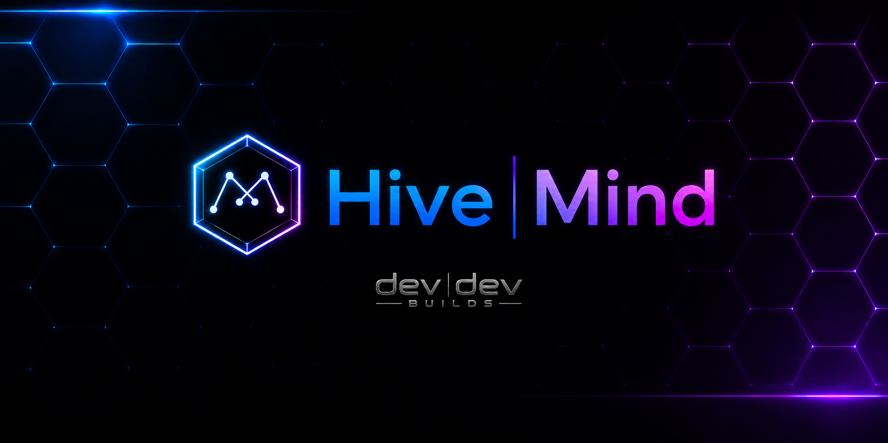
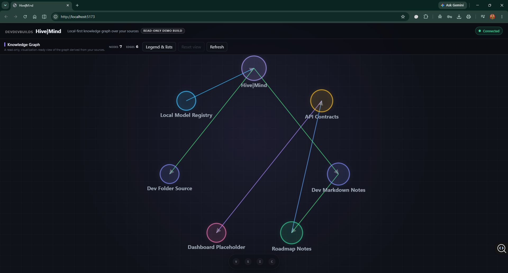
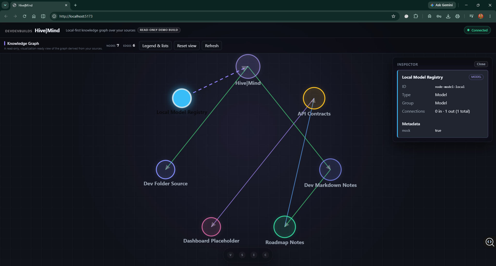
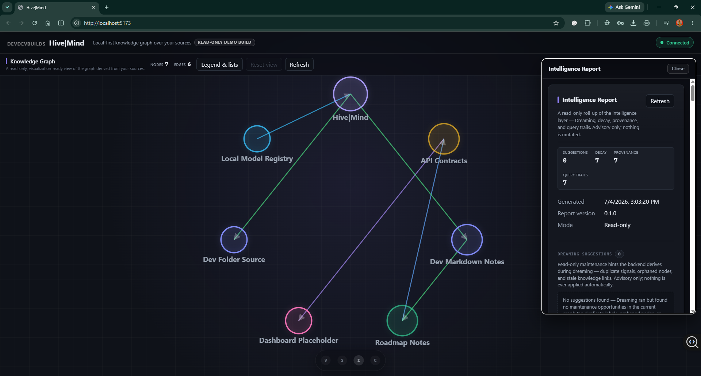

<!-- markdownlint-disable MD041 -->

# Hive|Mind

**A local workspace for understanding your projects, their sources, and the decisions behind them.**

Built under **devdevbuilds**.

Project notes, repository changes, and decisions tend to scatter across files and tools. Hive|Mind brings developer-owned information into one inspectable workspace. It shows where a piece of knowledge came from, how it connects to other work, and what the available evidence can actually support.

The app is designed for a developer who wants to ask, “What do we know about this project, and why do we believe it?” It is still a local, single-user tool under active development.

## What you can do today

- **Import your own material.** Register local sources and explicitly import an Obsidian vault. Hive|Mind organizes the imported information into records and relationships.
- **Explore a knowledge graph.** Move through connected nodes, open an inspector, and trace information back to its source. Browsing the graph does not edit the underlying data.
- **Inspect useful signals.** The Intelligence Report highlights aging information, possible duplicates or gaps, provenance chains, and related areas to investigate. These are explainable suggestions, not automatic judgments.
- **Check repository state.** Request a read-only snapshot or compare a repository with a baseline. The Repository Observer reports what changed and where its evidence came from; it does not watch continuously or modify Git.
- **Inspect Active Memory context.** Supply records to a read-only inspector and see a bounded context packet with warnings and contradictions. The normal inspector does not silently promote records into trusted memory.

Hive|Mind is **local first**: sources are brought in deliberately, and the graph and reports are meant to be inspected by a person. The current product does not run autonomous agents or change repositories on its own.

## Why the evidence matters

A useful project memory needs more than a convincing sentence. Hive|Mind keeps source references, review state, and limitations visible so a developer can distinguish an observation from an approved decision. Matching an export’s hash, for example, proves that the bytes match the declared export; it does not prove that every claim inside is true.

The long-term direction is to use grounded context to help draft plans and changes for human review. The **Grounded Synthesis Layer** has contracts, a read-only context assembler, and validation checks today. It does **not** yet generate proposals, write code, or apply changes. See the [architecture](docs/create-layer-architecture.md).

## Current status at a glance

| Area | Where it stands |
| --- | --- |
| Source registry, Obsidian import, knowledge graph, and Intelligence Report | Available in the local app. |
| Spatial Hive graph interaction | Experimental presentation. Hand-tracking tuning is unfinished. |
| Repository Observer | Explicit, read-only snapshots and drift analysis with a frontend inspector. No watcher or Git writes. |
| Active Memory inspection | Contracts, backend context building, contradiction checks, and a read-only inspector for supplied records. |
| Reviewed memory import | Backend coordinator, integrity-sealed local ledger and snapshot, receipts, recovery rules, and synthetic disposable rehearsal. No real dataset has been migrated. |
| Migration readiness | Read-only declared-manifest preflight and a fail-closed execution gate. Real source, destination, backups, restoration, and authorization are unverified. |
| Grounded Synthesis | Context assembly and validation foundation. Generation and an end-user workspace are planned. |

**Real-data migration remains blocked.** The Phase 40K.7 operational review recorded **NO-GO**. Its 13 blockers and 12 readiness criteria remain open in the repository baseline, and Phase 40L is locked. A Wave A independent review verified *candidate evidence* for B-12, B-02, and B-10; it did not close blockers or authorize an import. Before a real migration, the team must identify the exact dataset and destination, verify backup and restoration evidence, approve the execution contract, complete a fresh operational review, and give a separate human GO. The [migration runbook](docs/operations/phase-40k-authoritative-migration-runbook.md) and [remediation plan](docs/operations/phase-40k-8-operational-blocker-remediation-plan.md) contain the detailed gates.

The backend import work is narrower than a general Active Memory product. There is no public import API, frontend review workspace, automatic semantic promotion, or production-ready multi-user deployment. The read-only inspector and the reviewed import coordinator are different surfaces with different authority.

## How information moves

1. You choose a source and explicitly import it.
2. Hive|Mind normalizes the information into local records and graph relationships.
3. The graph and Intelligence Report let you inspect connections, age, gaps, and provenance.
4. Repository Observer can add a read-only view of repository state when requested.
5. Active Memory work can assemble evidence-linked context and flag contradictions. Moving reviewed *real* records into authoritative memory requires the separate migration controls above.

The [roadmap](docs/roadmap.md) has the full phase history. This README describes the product and current boundary without making you decode the entire development log first.

## See the app

These screenshots are from a connected local runtime, not mockups.

**Knowledge graph**

The graph fills the workspace while controls stay in context.

**Node inspector**

Selecting a node reveals its details and relationships.

**Intelligence Report**

The report presents read-only signals derived from existing records.

More captures and QA notes are in the [screenshots directory](docs/demo/screenshots/) and [graph surface evidence](docs/demo/phase-28c-true-graph-primary-surface-qa-screenshot-evidence.md).

## Run it locally

You need **Node.js 20+** and **Python 3.11+**. From PowerShell:

~~~powershell
Set-Location "C:\path\to\hive-mind"
npm install
python -m venv .venv
.\.venv\Scripts\Activate.ps1
python -m pip install -r apps/backend/requirements-dev.txt
~~~

Start the backend in one terminal:

~~~powershell
npm run dev:backend
~~~

Start the frontend in another:

~~~powershell
npm run dev:frontend
~~~

Open [http://localhost:5173](http://localhost:5173). The backend runs at [http://localhost:8787](http://localhost:8787), with [health](http://localhost:8787/api/health) and [API docs](http://localhost:8787/docs). The frontend uses **VITE_API_BASE_URL=http://localhost:8787/api** when configured from **.env.example**, and defaults to that local address when unset.

If you have [registered the workspace](scripts/workspaces/README.md), the managed local runtime can start both services:

~~~powershell
.\scripts\runtime\Invoke-HiveMindRuntime.ps1 start
.\scripts\runtime\Invoke-HiveMindRuntime.ps1 status
.\scripts\runtime\Invoke-HiveMindRuntime.ps1 stop
~~~

It waits for both services to become reachable and stops only processes it started. See the [runtime guide](docs/operator-runtime.md).

## Check the code

~~~powershell
npm run check:frontend
npm run check:backend
~~~

The root **npm run check** runs both. The frontend uses React, TypeScript, Vite, and CSS; the backend uses Python, FastAPI, and Pydantic. Local JSON-backed storage and explicit source adapters support the current workspace. Backend contracts define validated data shapes that the frontend consumes.

## Limits and next steps

Hive|Mind is not hardened for a public, multi-user service. It has no user authentication, cloud sync, live Obsidian watcher, or write-back to the vault. Repository checks happen when requested, not in the background. Intelligence suggestions remain advisory. Hand tracking is experimental.

The next major product direction is human-reviewed synthesis: use verified, source-linked context to prepare useful drafts and plans, then let a person decide what to do. No synthesis producer, AI provider integration, automatic repository mutation, or action authorization is shipped as part of that direction today. The real-data Active Memory migration also remains gated as described above.

## Explore the project

- [Roadmap and phase history](docs/roadmap.md)
- [Demo guide](docs/demo-guide.md)
- [API contract](docs/api-contract.md)
- [Active Memory and Verification reference](docs/active-agent-memory-verification-layer.md)
- [Repository Observer guide](docs/operator-repository-observer.md)
- [Grounded Synthesis architecture](docs/create-layer-architecture.md)
- [Agent Lab contribution governance](docs/agent-lab/README.md)
- [Migration runbook](docs/operations/phase-40k-authoritative-migration-runbook.md)
- [Migration blocker remediation plan](docs/operations/phase-40k-8-operational-blocker-remediation-plan.md)
- [Security threat model](docs/security/threat-model-and-vulnerability-test-plan.md)

Hive|Mind is a practical developer tool and a record of its own engineering choices: local data ownership, inspectable provenance, careful backend contracts, and human review before consequential changes.
