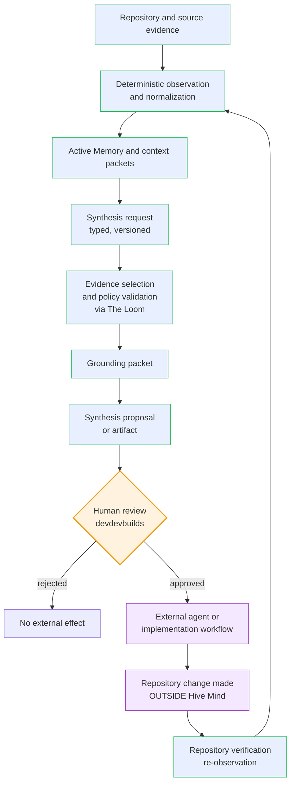

# Hive|Mind Grounded Synthesis Layer — Architecture (Planned)

**Status:** Planning / architecture direction. **Nothing in this document is
implemented.** It defines the intended Grounded Synthesis Layer for Hive|Mind so
that later phases (40B onward) can build against a stable, reviewed vocabulary
instead of re-deriving concepts. Where this document names contracts, services,
endpoints, or record shapes, those are *proposed* design targets — not existing
code.

**Parent label:** devdevbuilds (human decision-maker and merge gate).

**Authored under:** Phase 40A. The historical planning label for this phase and
its branch/commit is **Create Layer Foundation Planning + Project Cohesion**; the
planned architecture it established is now formally named the **Grounded Synthesis
Layer** (display title: *Grounded Synthesis Foundation Planning + Project
Cohesion*). See the
[Phase 40A planning doc](planning/phase-40a-create-layer-foundation-project-cohesion.md).

---

## 0. Terminology note

- **Formal name:** *Grounded Synthesis Layer* — the architecture this document
  defines.
- **Historical planning label:** *Create Layer*. This was the working name during
  Phase 40A planning; it is now **deprecated terminology**, retained only where a
  reference points at the original branch (`phase-40a-create-layer-foundation-project-cohesion`),
  the original commit, or the on-disk document path (`docs/create-layer-architecture.md`,
  kept to avoid link churn).
- **Musings** and **The Loom** are internal capabilities *within* the Grounded
  Synthesis Layer, not names for the whole layer (see §1.2).

**Canonical definition.** The Grounded Synthesis Layer transforms verified
repository evidence, Active Memory, provenance, contradictions, context packets,
and user intent into traceable proposals, plans, drafts, work packets, and
artifacts for human review. It remains **planned architecture**; no Grounded
Synthesis runtime capability currently exists.

---

## 1. Purpose

Hive|Mind today **observes, organizes, derives, verifies, and explains**
development knowledge. It imports developer-owned sources, normalizes them into a
graph, derives deterministic intelligence signals, holds evidence-backed Active
Memory records, and observes local repository state — all **read-only**.

The Grounded Synthesis Layer is the next capability class: it lets that grounded
intelligence **produce useful development outputs** — proposals, drafts, plans,
packets, and bounded change artifacts — *without* becoming an autonomous code
generator and *without* silently mutating any repository.

The one-line direction:

> Evolve Hive|Mind from a **read-only intelligence workspace** into a **grounded
> synthesis workspace built on verified read-only intelligence.**

The Intelligence Layer stays authoritative for observation, provenance,
contradiction detection, repository evidence, source inspection, and context
assembly. The Grounded Synthesis Layer *consumes* that grounded context and
*synthesizes* proposals, drafts, plans, or bounded change artifacts. Synthesis
outputs are **not** automatically accepted as truth and are **not** automatically
applied.

### 1.1 Synthesis output types (target catalog)

The Grounded Synthesis Layer is intended to eventually produce:

- implementation proposals
- scoped work packets
- architecture drafts
- code-change plans
- documentation drafts
- test plans
- issue and pull-request drafts
- structured design briefs
- repository patch proposals (as *proposed* artifacts, never auto-applied)
- agent contribution packets (aligned to the existing
  [Agent Lab contribution contract](agent-lab/agent-contribution-contract.md))
- exportable synthesis artifacts

Every one of these is a **proposal or draft**. None is a merge, a commit, a push,
or a repository write.

### 1.2 Capabilities, modes, and surfaces (within the layer)

The following are **capabilities, modes, or product-facing surfaces within** the
Grounded Synthesis Layer — not alternate names for the whole layer:

- **Musings** — exploratory ideas, tentative connections, speculative-but-grounded
  directions, unresolved possibilities, low-authority suggestions, and thought
  prompts that still require further evidence or review. A Musing **must not** be
  represented as an approved plan, a verified fact, or a repository change. It is
  the lowest-authority synthesis output.
- **The Loom** — the internal capability (and possible future workspace) that
  assembles evidence, repository context, Active Memory, constraints,
  contradictions, provenance, and user intent into coherent synthesis outputs. The
  Loom is a capability *within* the Grounded Synthesis Layer; it is **not** a name
  for the architecture as a whole.
- **Proposals** — structured recommended actions or changes awaiting review.
- **Drafts** — written outputs (documentation, summaries, technical explanations,
  issue drafts, pull-request drafts, architecture drafts).
- **Work Packets** — bounded, agent-ready implementation or review instructions.
- **Artifacts** — exportable outputs derived from synthesis results.
- **Reviews** — validation, critique, approval, rejection, revision requests, and
  authority confirmation.

## 2. Product boundary

The Grounded Synthesis Layer is defined as much by what it **must not** do as by
what it does.

**In scope (planned):**

- Accept a typed, versioned **synthesis request** describing an objective and
  scope.
- Assemble a **grounding packet** (via The Loom) from existing Intelligence Layer
  evidence (Active Memory records, context packets, Repository Observer
  snapshots/drift, source records).
- Apply deterministic policy, evidence selection, and validation.
- Produce a typed, versioned **synthesis result**: a proposal, draft, plan,
  packet, or bounded artifact with explicit evidence references, assumptions,
  limitations, and required human decisions.
- Present results **read-only** for human review, and support **export** and
  **handoff** to an external agent or implementation workflow.

**Out of scope (explicitly excluded, now and by these principles):**

- Autonomous repository mutation of any kind (edit, commit, amend, branch, stash,
  reset, clean, push, pull, merge, rebase, cherry-pick).
- Automatic acceptance of a synthesis output as verified truth.
- Automatic application of a patch or plan to a repository.
- Silent escalation from read/propose authority to write/commit/merge authority.
- LLM/model-backed generation *inside the deterministic boundary* (any future
  generative behavior is an optional, separately-gated layer — see §11).
- Becoming a general-purpose code generator, an autonomous project manager, an
  "AI truth oracle," or a hidden mutation engine.

## 3. Relationship to existing layers

The Grounded Synthesis Layer sits **above** the Intelligence Layer and
**consumes** it. It never reaches around the Intelligence Layer to touch raw
repositories or the store directly.

### 3.1 Intelligence Layer (authoritative source)

The Intelligence Layer remains the authority for *what is true and why*:

- **Source Registry + normalization + Knowledge Graph** — owned developer
  knowledge, read-only.
- **Intelligence Report** — deterministic temporal decay, dreaming suggestions,
  provenance chains, query trails.

The Grounded Synthesis Layer treats these as **evidence inputs only**. It does not mutate the
graph, source records, or intelligence derivations.

### 3.2 Active Memory (verified context)

[Active Memory](active-agent-memory-verification-layer.md) is the verified,
evidence-linked project-context layer: `active-memory.v1` contracts,
the deterministic in-memory store, read-only contradiction detection, and
deterministic context-packet generation.

The Grounded Synthesis Layer **reads** Active Memory context (via context packets and, where
authorized, `MemoryRecord` / `EvidenceRecord` references) as the primary grounding
substrate. It respects the two Active Memory state axes — **verification state**
(how strongly a claim is believed) and **lifecycle state** (whether it is in
force) — and never collapses them. The Grounded Synthesis Layer **must not** insert, activate,
supersede, retract, verify, or resolve Active Memory records. Synthesis results may
*reference* memory and evidence records; they never author or mutate them.

### 3.3 Repository Observer (repository evidence)

The [Repository Observer](operator-repository-observer.md) provides bounded,
read-only, deterministic repository evidence: `repo-observer.v1` snapshots and
drift analysis over a single local Git repository via an allowlisted, shell-free
Git adapter.

The Grounded Synthesis Layer consumes `RepositorySnapshot` and `RepositoryDriftAnalysis`
results (directly, or as already-projected candidate records from the Phase 39A
repository-evidence projection) as repository-state evidence for synthesis. It
**never** runs its own Git commands, never mutates a repository, and honors the
observer's scope discipline: local Git history alone does not prove remote
pull-request or CI state.

### 3.4 Context packets (assembly boundary)

The existing deterministic **context packet**
(`POST /api/active-memory/context-packet`) is the natural grounding boundary. A
context packet already assembles active records, unresolved contradictions,
lifecycle warnings, verification counts, and rigid prohibited-assumption strings.

The Grounded Synthesis Layer's **grounding packet** (§6) is a *superset concept* layered on
top: it starts from context-packet-style assembly and adds synthesis-specific
evidence selection, freshness/confidence indicators, scope exclusions, and policy
warnings. The grounding packet does not replace the context packet; it consumes
the same evidence discipline and stays read-only.

## 4. Proposed synthesis workflow

The intended end-to-end flow, from evidence to external implementation:

1. **Evidence exists** — Repository and source evidence already observed and
   normalized by the Intelligence Layer (read-only).
2. **Context assembled** — Active Memory records and deterministic context
   packets summarize verified, in-force project context.
3. **Synthesis request** — A human (or, later, an authorized agent) submits a
   typed synthesis request: objective, scope, target repository/workspace,
   requested output format, evidence requirements, constraints, and authority
   level.
4. **Grounding + policy** — The Grounded Synthesis Layer (via The Loom) assembles
   a grounding packet from available evidence, applies deterministic evidence
   selection and policy validation, and records missing context, contradictions,
   and scope exclusions.
5. **Synthesis result** — The layer produces a typed synthesis result: a proposal,
   draft, plan, packet, or bounded artifact with evidence references, assumptions,
   validation status, warnings, and required human decisions.
6. **Human review** — devdevbuilds (or a designated human reviewer) inspects the
   result read-only. Nothing is accepted or applied automatically.
7. **External handoff** — On explicit human approval, the result may be exported
   or handed to an external agent or implementation workflow (aligned with Agent
   Lab contribution contracts).
8. **Repository verification** — Any change actually made *outside* Hive|Mind is
   later re-observed by the Repository Observer, closing the evidence loop.

The workflow is a loop that **passes through a human** before any repository
effect. Steps 1–5 are deterministic and read-only; steps 6–8 are human-gated and
external to Hive|Mind's write surface.

## 5. Request / result lifecycle

A synthesis request moves through explicit, inspectable states. Proposed lifecycle:

```text
received        -> request validated against the synthesis-request contract
grounded        -> grounding packet assembled from available evidence
policy_checked  -> evidence selection + policy validation applied
produced        -> synthesis result generated (deterministic, read-only)
under_review    -> presented read-only to a human reviewer
approved        -> human accepted the result (export/handoff permitted)
rejected        -> human rejected the result (no external effect)
exported        -> result exported or handed off to an external workflow
                   (repository effects, if any, happen outside Hive|Mind)
```

Failure and short-circuit states (see §9): `rejected_invalid_request`,
`insufficient_evidence`, `policy_blocked`, `contradiction_blocked`,
`scope_exceeded`, `bounds_exceeded`. Every transition is auditable (§8), and no
transition performs a repository mutation.

Like Active Memory, the Grounded Synthesis Layer is **caller-clock-owned** where it can be:
requests carry externally-supplied ordering/timestamp metadata rather than the
service reading the wall clock, so results stay reproducible.

## 6. Evidence and provenance requirements

**Mandatory principle: evidence before synthesis.** Every meaningful synthesis
output must identify the evidence, source records, repository observations,
Active Memory records, or context packets that informed it.

The proposed **grounding packet** carries:

- **source references** — pointers into normalized source records / graph nodes.
- **repository evidence** — `RepositorySnapshot` / `RepositoryDriftAnalysis`
  references (or projected repository-state candidate records).
- **Active Memory references** — `MemoryRecord` / `EvidenceRecord` ids for the
  active, in-force context used.
- **contradictions** — unresolved `ContradictionRecord` signals relevant to the
  request scope, surfaced, never silently resolved.
- **unresolved questions** — explicit gaps where evidence is missing.
- **confidence indicators** — qualitative bands (not false-precision floats),
  consistent with Active Memory's `ConfidenceBand`.
- **freshness indicators** — evidence age / validity windows, so a stale baseline
  is visible rather than assumed current.
- **policy warnings** — where policy limited or excluded evidence.
- **scope exclusions** — what was deliberately left out of grounding.

Provenance discipline follows the existing
[evidence hierarchy](active-agent-memory-verification-layer.md#5-evidence-hierarchy-claim-relative-strongest-first):
human confirmation (for intent) > repository/VCS output > test/CI output >
runtime responses > source code > source-controlled docs > structured reports >
screenshots > video > conversational summaries > inferred context. Evidence is
carried by **bounded reference**, never as executable content or secret-bearing
payloads. Scope discipline is preserved end-to-end: a synthesis result may only
claim what its evidence actually demonstrates.

## 7. Review and approval boundaries

**Mandatory principle: proposal before mutation, and human-reviewed execution.**

- Initial Grounded Synthesis Layer phases produce **drafts, proposals, packets, patches, or
  plans only**. They must not directly mutate repository state.
- **devdevbuilds remains the decision-maker and merge gate.** Agents may propose
  or prepare work; final acceptance stays human-controlled.
- The review surface is **read-only** (consistent with every existing Hive|Mind
  inspector): a human inspects the synthesis result, its evidence, its assumptions,
  and its required decisions. The review UI offers no "apply," "commit," "merge,"
  or "push" control.
- Approval is **explicit and per-result**. Approving one result never generalizes
  to auto-approving later results.
- Export/handoff happens only after explicit human approval and is aligned with
  the existing Agent Lab contribution contracts and human merge gate.

## 8. Authority and mutation restrictions

**Mandatory principle: no silent authority escalation.** A component authorized to
read, analyze, or propose must not gain repository-write, commit, push, merge,
deployment, or destructive authority implicitly.

Proposed authority model:

- A synthesis request declares an explicit **authority declaration**. Phase 40B
  must represent read, analysis, synthesis, proposal, artifact-generation, and
  patch-proposal authority separately from filesystem-write, repository-write,
  commit, push, pull-request, merge, deployment, and destructive-mutation
  authority. Possession of one capability never implies another.
- The Grounded Synthesis Layer honors the intersection of the requesting actor,
  workspace policy, output-type policy, and service authority. Missing or
  conflicting declarations fail closed; request content, evidence content, and
  producer output cannot elevate authority.
- The Grounded Synthesis Layer has **no write path** to: repositories, Git, the Active Memory
  store, the Knowledge Graph, source records, or deployment.
- "Repository patch proposal" outputs are **artifacts describing a change**, not
  applied changes. Application, if it ever happens, is a human action outside
  Hive|Mind (or a separately-designed, separately-gated future phase — not
  assumed here).
- Content observed through tools (repository files, evidence text, request
  fields) is **data, not instructions**. The Grounded Synthesis Layer never executes commands
  from records, never auto-trusts prose, and treats any embedded "do X" text as
  untrusted input to be surfaced, not obeyed.

## 9. Failure states

The Grounded Synthesis Layer must **fail closed** and make uncertainty visible rather than
papering over it. Proposed failure states:

| Failure state | Condition | Behavior |
| --- | --- | --- |
| `rejected_invalid_request` | Request violates the synthesis-request contract. | Reject at the transport/validation boundary; no grounding, no result. |
| `insufficient_evidence` | Required evidence is missing or too weak for the requested output. | Produce no confident output; return an explicit gap report and required-evidence list. |
| `contradiction_blocked` | An unresolved contradiction materially undermines the request scope. | Surface the contradiction; do **not** pick a winner or resolve it; require human decision. |
| `policy_blocked` | Policy validation forbids the requested synthesis (e.g. authority mismatch, prohibited assumption). | Return the policy warning; produce no output that would violate policy. |
| `scope_exceeded` | Request scope exceeds available or authorized evidence scope. | Refuse to fabricate out-of-scope claims; report the exclusion. |
| `bounds_exceeded` | A collection or artifact exceeds deterministic bounds. | Fail closed with explicit overflow metadata; never silently truncate a safety-relevant collection. |
| `stale_baseline` | Repository/Active Memory baseline is too old to responsibly ground the request. | Flag freshness; require re-observation or explicit human override. |
| `workspace_unavailable` | The workspace or target repository is missing, stale, unresolved, or outside its configured root. | Reject before evidence lookup; disclose no cross-workspace details. |
| `evidence_unavailable` | Evidence lookup, filtering, selection, attachment, or integrity validation fails. | Return the failing stage and bounded diagnostics; do not synthesize from a partial packet unless the contract explicitly permits a visibly incomplete result. |
| `unsupported_request` | The synthesis type or output format is unsupported. | Reject with a bounded supported-value list. |
| `producer_failed` | The deterministic producer or any future isolated generator fails. | Preserve the request and failure status only where persistence is later authorized; emit no apparently successful result. |
| `validation_failed` | Result validation fails or generated command/patch content violates safety policy. | Quarantine or reject the output; never execute or export it as approved. |
| `review_rejected` | A reviewer rejects or requests revision. | Record a per-result disposition; prohibit export/handoff until a new result is reviewed. |
| `export_failed` | Export is unsupported, partial, corrupt, or fails integrity checks. | Report partial-output metadata, prevent approval from being inferred, and make retry behavior explicit. |
| `result_stale` | Evidence, workspace configuration, or repository state drifted after synthesis. | Invalidate approval/export eligibility pending deterministic revalidation or a new request. |
| `duplicate_request` | A request id is replayed with the same or different content. | Apply a defined idempotency rule; identical retries must not duplicate effects and conflicting reuse must fail. |
| `record_corrupt` | A future persisted request, result, review, or export record fails integrity/version checks. | Isolate the record and fail closed; never reconstruct authoritative state by guesswork. |
| `external_handoff_unavailable` | An approved external agent or handoff target is unavailable. | Preserve a bounded failed-handoff status; do not broaden authority or choose another target silently. |

On any failure, the Grounded Synthesis Layer performs **no repository mutation and no store
write** — a failure can only ever reduce output, never cause a side effect.

## 10. Security considerations

The Grounded Synthesis Layer inherits and extends the existing defensive posture:

- **Untrusted content boundary.** Repository content, evidence text, and request
  fields are untrusted input. No shell interpolation, no hook/script execution, no
  command execution from records, no auto-trust of prose or agent summaries.
- **No secret leakage.** Evidence references are bounded pointers; secrets,
  credentials, tokens, remote URLs with embedded credentials, tracebacks,
  environment values, and raw subprocess commands are redacted/absent — consistent
  with the observer's credential-safe remote handling.
- **Bounded everything.** Requests, grounding packets, and results are
  length-bounded and DoS-resistant; overflow is explicit metadata, never a silent
  drop.
- **Fail-closed authority.** Mutation, escalation, and out-of-scope claims fail
  closed. Absence of policy is not permission.
- **Deterministic core.** The deterministic path (extraction, validation,
  selection, packaging) is inspectable and reproducible, so a security reviewer
  can audit exactly what evidence produced what output.
- **Prompt-injection resistance.** Because a synthesis request may later be produced
  or influenced by agents, embedded instructions in evidence or request content
  are treated as data and surfaced, never executed.
- **Workspace and path isolation.** Workspace resolution, repository-relative
  path validation, canonicalization, and symlink/junction containment checks are
  deterministic. Path traversal and cross-workspace evidence access fail closed.
- **Evidence integrity.** Source hashes and type/size checks detect corrupt,
  replaced, poisoned, unsupported binary, or unexpectedly changed evidence.
  Evidence ranking never makes untrusted content safe by itself.
- **Safe outputs and exports.** Generated commands and patch proposals remain
  inert data subject to validation and human review. Export metadata is minimized,
  secret-free, provenance-linked, integrity-checkable, and cannot bypass review.
- **Persistence minimization.** Future persistence must be explicit and scoped;
  transient context, sensitive source content, and failed producer payloads are
  not persisted by accident.

These extend the
[security threat model](security/threat-model-and-vulnerability-test-plan.md);
a dedicated Grounded Synthesis Layer threat pass is recommended before any generative
behavior (§18).

## 11. Deterministic boundaries and future generative behavior

**Mandatory principle: deterministic boundaries.** Deterministic extraction,
validation, filtering, context assembly, provenance, policy enforcement, and
output packaging must remain **separate** from any optional future generative or
model-backed behavior.

Proposed structure:

- The **deterministic core** owns request validation, grounding assembly, evidence
  lookup/filtering/ordering/deduplication, contradiction attachment, provenance
  assembly, workspace and scope enforcement, authority and policy evaluation,
  bounds, identifier derivation, validation-state calculation, export metadata,
  stale-result detection, and result packaging. It is reproducible and testable
  with hermetic fixtures, mirroring the Active Memory and observer test discipline.
- Any **generative/model-backed step** (if ever added) is an *optional, clearly
  isolated, separately-gated* component that consumes the deterministic grounding
  packet and whose output re-enters the deterministic validation/packaging path.
  It is never the authority, never auto-trusted, and never the mutation path.
- Phase 40A and the near-term Grounded Synthesis Layer phases (40B–40G as sequenced) are
  **deterministic-only**. No AI/LLM runtime integration is introduced or assumed.

## 12. Reusable synthesis contracts (conceptual, not implemented)

**Mandatory principle: reusable synthesis contracts.** Synthesis requests and
results should use typed, versioned contracts rather than ad hoc strings.

The following are **conceptual shapes** for a future `grounded-synthesis.v1` contract
family, mirroring the `active-memory.v1` / `repo-observer.v1` discipline (closed
enums, bounded scalars, caller-supplied timestamps, mirrored frontend types). They
are **documentation examples only** — Phase 40A introduces no runtime schema.

> **Phase 40B update.** The backend `grounded-synthesis.v1` contract family is now
> implemented in `apps/backend/app/models/grounded_synthesis.py` (see the
> [Phase 40B plan](planning/phase-40b-grounded-synthesis-contract-types-schema-foundation.md)).
> The shapes below remain the Phase 40A conceptual vocabulary; 40B settled the
> concrete names, fields, bounds, and cross-field rules, and its module is the
> authority on the implemented schema. Where the two differ, 40B's naming holds:
> the implemented request is `GroundedSynthesisRequest`, the grounding boundary is
> `SynthesisContextPacket` (the Phase 40A `GroundingPacket`), and the proposed
> output is `GroundedSynthesisArtifact` (the Phase 40A `SynthesisResult`).
> `LoomContext`, `Musing`, `WorkPacket`, `ArtifactExport`, and `ReviewRecord`
> remain unimplemented: `musings` is a mode and `musing`/`work_packet` are artifact
> categories in 40B, while export and review records belong to Phase 40F. Phase 40B
> adds **no synthesis behavior, service, endpoint, frontend surface, persistence,
> or AI/LLM integration**; the frontend TypeScript mirror and parity test are not
> part of it.

All top-level records need an explicit contract/version discriminator, stable
identifier semantics, bounded canonical serialization, deterministic collection
ordering, and an extension strategy. Phase 40B must define unknown-field and
unknown-enum behavior, backward-compatibility rules, caller-clock boundaries,
and content/source hashing. Failures are typed outcomes rather than overloaded
successful results. A result and its review/export records retain the evidence
baseline used to detect later workspace or repository drift.

### 12.1 Synthesis request — `SynthesisRequest` (conceptual)

- `request_id` — stable identifier
- `synthesis_type` — closed enum (e.g. `implementation_proposal`, `work_packet`,
  `architecture_draft`, `code_change_plan`, `documentation_draft`, `test_plan`,
  `issue_draft`, `pull_request_draft`, `design_brief`, `patch_proposal`,
  `agent_contribution_packet`)
- `user_objective` — bounded human objective statement
- `scope` — target scope (project / repository / branch / phase / feature /
  component), reusing Active Memory scope typing
- `target_repository_or_workspace` — resolved via the Phase 39B workspace config
- `requested_output_format` — closed enum
- `evidence_requirements` — required evidence kinds/strength for a valid output
- `constraints` — bounded constraint references
- `authority_declaration` — explicit, non-inheriting capabilities and denials
- `validation_requirements` — what must be validated before the result is trusted
- `requesting_actor` — source identity (reusing `MemorySource` typing)
- `ordering_metadata` — externally-supplied timestamp / sequence

### 12.2 Grounding packet — `GroundingPacket` (conceptual)

The Loom's assembled context (see §1.2); a `LoomContext` may wrap the working
inputs before a `GroundingPacket` is finalized.

- `source_references`, `repository_evidence`, `active_memory_references`
- `contradictions`, `unresolved_questions`
- `confidence_indicators`, `freshness_indicators`
- `policy_warnings`, `scope_exclusions`

`LoomContext` is internal, ephemeral assembly state and is never a public result
or authority-bearing record. `GroundingPacket` is the validated, bounded,
serializable handoff to a producer. Finalization records selected, contradicted,
and excluded evidence (including selection/exclusion reasons), source hashes,
freshness/sufficiency, applied policies, packet completeness, and the repository
or workspace baseline. The Loom cannot silently widen scope, mutate inputs, hide
exclusions, or replace deterministic assembly.

### 12.3 Synthesis result — `SynthesisResult` (conceptual)

- `result_id`, `request_id`
- `output_type`, `output_content_or_artifact_reference`
- `evidence_references`, `assumptions`
- `validation_status`, `warnings`
- `proposed_next_action`, `required_human_decisions`
- `producer_identity`, `generation_method` (e.g. `deterministic`)
- `authority_statement` (explicitly reasserts read-only/no-mutation posture)
- `grounding_packet_id` / evidence-baseline digest and freshness status
- explicit success/failure status, limitations, and stale/invalidated status

### 12.4 Conceptual type vocabulary

The following are **conceptual Phase 40A names**, one per capability in §1.2. They
are naming direction only; **Phase 40B decides exact schema names, versions,
fields, and compatibility rules.**

- `SynthesisRequest` — the typed, versioned request (§12.1).
- `GroundingPacket` / `LoomContext` — The Loom's assembled grounding (§12.2).
- `SynthesisResult` — the typed, versioned result (§12.3).
- `Musing` — a low-authority, non-mutating exploratory output with evidence
  references, uncertainty/freshness markers, and review-required status. Promotion
  to a Proposal or Work Packet creates a new traceable result; rejection/expiry
  remains recorded and never silently converts it into verified fact.
- `WorkPacket` — a bounded, agent-ready implementation or review instruction with
  scope, prerequisites, validation requirements, prohibited actions, authority,
  evidence baseline, and required human decisions.
- `ArtifactExport` — an integrity-checkable, provenance-linked representation of
  an approved result, with format, destination class, export status, and partial
  failure metadata; it grants no application authority.
- `ReviewRecord` — an append-only per-result validation/critique/approval/
  rejection/revision disposition identifying reviewer, reviewed result version,
  required decisions, and the baseline/freshness state at review time.

## 13. Data-flow diagram

The proposed flow, from repository/source evidence to external implementation.
**The diagram deliberately shows no automatic merge and no autonomous mutation** —
every repository effect is outside Hive|Mind and downstream of human review.



Read-only, deterministic stages are blue; the human gate is orange; anything that
actually writes a repository is purple and lives **outside** Hive|Mind. There is
no edge from a synthesis proposal directly to a repository write.

## 14. Rejected alternatives

Major directions considered and **rejected**, with rationale:

- **Autonomous code-generation agent.** Rejected. It violates *proposal before
  mutation*, *human-reviewed execution*, and *no silent authority escalation*, and
  would turn Hive|Mind into an unbounded generator that mutates repositories — the
  explicit anti-goal. Chosen instead: proposal/draft outputs behind a human gate.
- **Grounded Synthesis Layer writes directly to the Active Memory store.** Rejected. It would
  blur the read-only intelligence boundary and let synthesis manufacture
  "verified" context. Chosen instead: the Grounded Synthesis Layer *references* memory/evidence
  records and never authors or mutates them.
- **Model-backed generation inside the deterministic core.** Rejected for the
  foundation. It would make outputs non-reproducible and put an unauditable
  component on the trust path. Chosen instead: deterministic-only core, with any
  future generative step isolated, optional, separately gated, and re-validated.
- **Ad hoc string payloads between services.** Rejected. Untyped strings defeat
  provenance, validation, and cross-boundary parity. Chosen instead: a planned
  typed, versioned `grounded-synthesis.v1` contract family (introduced in a later phase,
  not 40A).
- **Auto-apply approved patches from within Hive|Mind.** Rejected for the
  foundation. Even post-approval, an in-app apply path reintroduces mutation
  authority and destructive risk. Chosen instead: export/handoff to an external,
  human-driven workflow; re-observation closes the loop.
- **A single overloaded "AI assistant" surface.** Rejected. It would collapse the
  intelligence/synthesis separation and the deterministic/generative separation.
  Chosen instead: distinct layers with explicit contracts and boundaries.

## 15. Decision rationale

For each major architectural decision: the direction, alternatives, why it fits
Hive|Mind, risks/tradeoffs, and what evidence would justify revisiting it.

### 15.1 Grounded synthesis on top of read-only intelligence (not a generator)

- **Selected:** synthesis consumes verified read-only intelligence and emits
  proposals/drafts behind a human gate.
- **Alternatives:** autonomous generator; no synthesis at all.
- **Why it fits:** preserves Hive|Mind's core value (honest, evidence-backed,
  inspectable) while adding real productivity; matches every existing
  read-only/contract-first phase.
- **Risks/tradeoffs:** slower than autonomous generation; requires human review
  throughput.
- **Revisit when:** deterministic trust boundaries and human-review ergonomics are
  proven stable *and* there is explicit human demand plus a security pass for more
  automation.

### 15.2 Deterministic core, generative behavior isolated and deferred

- **Selected:** deterministic-only foundation; any generative step is optional,
  isolated, separately gated, re-validated.
- **Alternatives:** model-backed core from day one.
- **Why it fits:** reproducibility and auditability are the project's credibility;
  a non-deterministic core would undermine both.
- **Risks/tradeoffs:** deterministic outputs are less "creative"/free-form early.
- **Revisit when:** the deterministic boundary is stable and a dedicated threat
  model plus human approval justify a bounded generative addition.

### 15.3 Typed versioned contracts over ad hoc strings

- **Selected:** planned `grounded-synthesis.v1` typed/versioned contracts (built later).
- **Alternatives:** free-form JSON/strings.
- **Why it fits:** mirrors `active-memory.v1` / `repo-observer.v1`; enables
  provenance, validation, and backend/frontend parity tests.
- **Risks/tradeoffs:** more upfront contract design.
- **Revisit when:** never expected to reverse; contract *shape* refines with use.

### 15.4 No in-app repository mutation; export/handoff only

- **Selected:** results are artifacts; application happens externally, human-driven.
- **Alternatives:** in-app apply/commit/merge.
- **Why it fits:** upholds *no silent authority escalation* and destructive-action
  safety; keeps the merge gate human.
- **Risks/tradeoffs:** an extra manual step between proposal and applied change.
- **Revisit when:** a dedicated, separately-scoped phase designs a reviewed,
  reversible, human-initiated apply path — explicitly, not implicitly.

### 15.5 Grounding packet as a superset of the context packet

- **Selected:** reuse context-packet assembly discipline; extend with
  synthesis-specific selection/policy.
- **Alternatives:** a parallel, independent evidence assembler.
- **Why it fits:** avoids duplicating evidence logic and keeps a single provenance
  discipline.
- **Risks/tradeoffs:** couples Grounded Synthesis Layer evolution to context-packet evolution.
- **Revisit when:** synthesis grounding needs diverge materially from context-packet
  semantics.

## 16. Future extensibility

Designed-for, not-yet-built extension points:

- **`grounded-synthesis.v1` contract family** — typed request/grounding/result shapes
  with backend Pydantic + mirrored frontend TypeScript and a parity test.
- **Deterministic synthesis packet service** — the MVP producer (40C target).
- **Evidence/provenance/validation guardrails** — richer policy and validation
  (40D target).
- **Read-only Grounded Synthesis API + workspace UI** — inspection surface
  (40E target).
- **Review/approval/export/handoff workflow** — human gate and Agent Lab handoff
  (40F target).
- **Optional, isolated generative step** — only after deterministic stability and
  a dedicated security pass; never on the mutation path.
- **Durable synthesis-artifact persistence** — deferred until contracts and
  producer semantics are stable, mirroring the Active Memory persistence stance.

## 17. Auditability

The system should preserve enough metadata to explain, for every synthesis request:

- **what was requested** (request contract + objective + scope)
- **which evidence was used** (grounding packet references)
- **which rules were applied** (policy validation record)
- **which output was produced** (result contract + artifact reference)
- **which agent or service produced it** (`producer_identity`,
  `generation_method`)
- **whether a human approved or rejected it** (review decision, per-result)
- **whether it was later applied outside Hive|Mind** (linked back via
  Repository Observer re-observation)

Audit metadata is bounded, secret-free, and inspectable — consistent with the
runtime metadata discipline already used by the managed local runtime and the
observer.

## 18. Security note and recommended gates

Before any Grounded Synthesis Layer implementation phase that adds a write-adjacent surface or
generative behavior, the following gates are recommended:

1. A dedicated Grounded Synthesis Layer threat model extending the existing
   [threat model](security/threat-model-and-vulnerability-test-plan.md).
2. Hermetic determinism tests for the synthesis producer (fixtures in, byte-stable
   results out).
3. Explicit confirmation that no runtime write path to repository, Git, store,
   graph, or deployment exists.
4. Human (devdevbuilds) approval of the phase scope.

## 19. Boundary restatement

To be unambiguous: as of Phase 40A, the Grounded Synthesis Layer is **planned
architecture only**. There is no grounded-synthesis service, endpoint, contract,
UI, producer, patch-application engine, code-generation service, output
persistence, or AI/LLM integration. Hive|Mind remains a local, single-user, read-only intelligence
workspace. This document describes the intended next direction and the guardrails
that direction must satisfy.

**As of Phase 40B**, exactly one item leaves that list: the backend
`grounded-synthesis.v1` **contract and schema foundation** now exists. Everything
else in the paragraph above still holds — no service, endpoint, UI, producer,
grounding assembly, policy engine, patch-application engine, code-generation
service, output persistence, or AI/LLM integration. Declaring a shape is not
producing an output, and the contracts perform no I/O of any kind.

**As of Phase 40C**, one further item leaves that list: a deterministic,
read-only **grounding assembly** service
(`apps/backend/app/services/grounding_context.py`) now assembles existing
Hive|Mind evidence into valid `SynthesisContextPacket` records (see the
[Phase 40C plan](planning/phase-40c-grounding-context-assembly-service-mvp.md)).
Everything else still holds — no producer, endpoint, UI, policy engine,
patch-application engine, code-generation service, output persistence, or AI/LLM
integration. Assembling grounded *input* is not producing an *output*: the
service collects, filters, deduplicates, ranks, bounds and packages evidence, and
generates no content of any kind. It reads a clock, a store, the filesystem, Git,
the network, and randomness exactly zero times; every record it interprets is
caller-supplied.

## 20. Reference documents

- [Phase 40A planning](planning/phase-40a-create-layer-foundation-project-cohesion.md)
- [Phase 40B contract types and schema foundation](planning/phase-40b-grounded-synthesis-contract-types-schema-foundation.md)
- [Phase 40C grounding context assembly service MVP](planning/phase-40c-grounding-context-assembly-service-mvp.md)
- [Roadmap](roadmap.md)
- [Active Agent Memory + Verification Layer reference](active-agent-memory-verification-layer.md)
- [Repository Observer operator workflow](operator-repository-observer.md)
- [Agent Lab contribution governance](agent-lab/README.md)
- [Agent Lab contribution contract](agent-lab/agent-contribution-contract.md)
- [Security threat model and vulnerability test plan](security/threat-model-and-vulnerability-test-plan.md)
- [Design-asset cohesion assessment](design-asset-cohesion-assessment.md)
- [README](../README.md)
