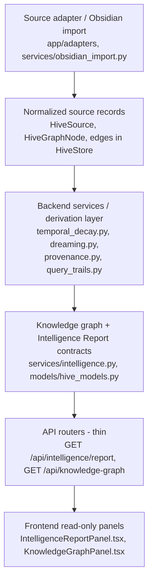

# Phase 17B — Intelligence Report Cohesion Hardening + Readiness QA

Parent label: **devdevbuilds**

Phase 17B is a **documentation / readiness-only** phase. It adds no backend
logic, no frontend components, no endpoints, no contracts, no schema, no
persistence, and no dependencies. It hardens the *reviewer-facing* readiness of
the Intelligence Report system — rationale, thresholds, edge-case coverage,
evidence expectations, performance notes, and a future adapter strategy — before
any further intelligence logic is built.

It is the implementation-readiness companion to the
[Phase 17A Intelligence Report Cohesion + System Readiness Plan](intelligence-report-cohesion-readiness-plan.md),
which set the cohesion direction. 17A asked *what should be aligned*; 17B writes
down *why the current system is built the way it is* and *what a reviewer should
expect at each edge*, integrating external backend-review feedback without
expanding product behavior.

## Why this phase exists

The Intelligence Report now carries four backend-derived, read-only surfaces:
**Temporal Knowledge Decay**, **Dreaming Suggestions**, **Provenance Chains**,
and **Query Trails**. Each was shipped contract-first, then backend-derived, then
made frontend-visible (Phases 13–16). A backend reviewer praised the layered
architecture, the deterministic backend logic, the controlled scope/guardrails,
the stable contracts-before-expansion discipline, and testing as part of the
architecture — and asked for clearer *why* explanations, explicit decay
thresholds, performance considerations, a future adapter strategy, a small
data-flow diagram, a dedicated edge-cases section, and evidence fields for every
derived decay item.

This document answers that feedback. It is the readiness pass that makes the
existing system legible to a reviewer before active vulnerability hardening or
new intelligence logic begins. Boring and correct on purpose: nothing here
changes behavior; it makes the behavior already in the repo easier to trust,
reproduce, and extend.

## 1. Architecture / data-flow diagram

The Intelligence Report is a single read-only projection over the same store and
source-registry state the rest of the app reads. Data flows in one direction:
external content is normalized at the edge, derivation happens in backend
services, and the frontend only displays. There is no path from a frontend panel
back into the graph.



ASCII fallback (matches the rest of the docs and reads the same in plain text):

```text
Source adapter / Obsidian import        (intake — edge of the system)
        |
        v
Normalized source records               (HiveStore: sources, nodes, edges)
        |
        v
Backend services / derivation layer     (deterministic, read-only services)
        |
        v
Knowledge graph + report contracts      (intelligence.py + Pydantic contracts)
        |
        v
API routers (thin)                      (GET /api/intelligence/report)
        |
        v
Frontend read-only panels               (display only — no write path back up)
```

The separation that matters:

- **Source intake** — adapters/import are the *only* place external content
  enters; everything downstream consumes normalized records, never raw vault
  shapes.
- **Normalization** — content becomes `HiveSource` / `HiveGraphNode` / edge
  records in `HiveStore` before any derivation runs.
- **Backend services** — each surface has its own pure derivation function over
  store state (`derive_decay_statuses`, dreaming, provenance,
  `derive_query_trail_entries`).
- **API routers** — thin: they call the service/aggregator and return contract
  objects; they hold no derivation logic.
- **Frontend** — read-only panels render contract data and label provenance; no
  panel mutates the graph, store, or sources.

## 2. Design rationale notes (the "why")

Brief, reviewer-facing rationale for the major decisions already in the repo.

- **Thin routers.** Routers stay request/response only so derivation logic lives
  in one testable place per surface. A reviewer can read a service function and
  reproduce its output from store state without untangling HTTP concerns; tests
  exercise the service directly.
- **Dedicated backend services per surface.** Each lens
  (`temporal_decay.py`, `dreaming.py`, `provenance.py`, `query_trails.py`) owns
  its rules. Keeping them separate means one surface's thresholds or evidence
  shape can evolve without destabilizing the others, and each can be unit-tested
  in isolation.
- **Deterministic derivation (no AI/LLM).** Pure functions over current store
  state return identical output for identical input. This is what makes the
  report reviewable and reproducible — a reviewer can point the derivation at a
  known store and verify every row. An LLM/embedding layer added now would make
  output unverifiable and undercut data-provenance honesty, so it stays a
  separately-planned future phase.
- **Read-only intelligence surfaces.** Every surface observes and suggests; none
  mutate the graph, store, or sources. This keeps Hive|Mind safe to point at real
  knowledge and is what lets the report act as a coordination/analysis layer
  without risking the authoritative store. Suggestions are advisory, never
  silently applied.
- **Stable contracts before feature expansion.** Contract types
  (`models/hive_models.py`) are aligned *before* derivation ships (the
  16A→16B→16C sequence is the template). Locking the wire shape first means
  frontend and tests can depend on it while logic fills in, and expansion stays
  additive.
- **Evidence metadata.** Derived rows carry a `metadata` trail explaining *why*
  the row exists (reason, fields used, derivation summary). Evidence is what
  turns a derived suggestion from "trust me" into "here is the store data this
  came from," which is the core value proposition for a dev tool.
- **MVP constants for Temporal Decay.** Thresholds are plain module constants
  (`FRESH_MAX_DAYS = 30`, `AGING_MAX_DAYS = 90`) rather than configuration. A
  constant is trivially reviewable and stable across runs; configuration adds a
  surface area (validation, persistence, precedence) that the current readiness
  state does not justify. See §3.
- **Normalized source-adapter boundary.** All external content is normalized into
  the shared record shape at intake, so downstream services never special-case a
  source type. This is what lets future adapters be added without touching
  derivation. See §7.

## 3. Temporal Knowledge Decay thresholds

Temporal Decay is derived in
[`apps/backend/app/services/temporal_decay.py`](../apps/backend/app/services/temporal_decay.py)
by `derive_decay_statuses`. It is pure timestamp arithmetic over store
nodes/sources — no scoring engine, no AI, no randomness (`now` is injectable so
tests are deterministic).

### Status buckets and MVP threshold constants

Each node is classified by the **age in whole days of its most recent usable
timestamp** (`max` of `updated_at`, a best-available "imported at" signal, and
`created_at`):

| Status (`DecayStatusBucket`) | Rule | Meaning | `review_needed` |
| --- | --- | --- | --- |
| `fresh` | `age_days <= FRESH_MAX_DAYS` (≤ 30d) | Recently active; trustworthy as current. | `false` |
| `aging` | `FRESH_MAX_DAYS < age_days <= AGING_MAX_DAYS` (≤ 90d) | Getting old; worth a glance. | `true` |
| `stale` | `age_days > AGING_MAX_DAYS` (> 90d) | Old enough to warrant review. | `true` |
| `unknown` | No usable timestamp on the node | Freshness cannot be assessed; **not** treated as stale. | `true` |

The thresholds are inclusive upper bounds, kept as module constants
(`FRESH_MAX_DAYS = 30`, `AGING_MAX_DAYS = 90`) so the rule is trivially
reviewable. Output is sorted most-needs-attention-first
(`stale` → `unknown` → `aging` → `fresh`, then by `node_id`).

### Evidence expected on every decay item

Every `DecayStatus` row carries enough for a reviewer to reproduce the
classification:

- Structured fields: `node_id`, `status`, `last_imported_at`,
  `last_referenced_at` (currently always `null` — no reference signal exists
  yet), `last_updated_at`, `source_reliability_hint`, `review_needed`.
- `metadata.derived = true` (it is a derivation, not a fixture).
- `metadata.reason` — a human-readable sentence naming the reference date, the
  age in days, and the thresholds applied (or, for `unknown`, that no usable
  timestamp exists).
- `metadata.age_days` — the integer age the bucket was computed from (omitted for
  `unknown`, where there is no age).

See §5 for how this relates to the richer nested `metadata.evidence` shape the
other three surfaces use, and the cohesion note about aligning them.

### Why thresholds are simple constants for now

- **Reviewability.** A constant is the most auditable possible form of the rule:
  a reviewer reads two numbers and knows the entire classification boundary.
- **Determinism.** No configuration means no run-to-run variance and no hidden
  precedence between defaults, env, and stored config.
- **Honest MVP.** 30/90 days are advisory bucket boundaries, not a tuned model.
  Presenting them as constants is honest about that; presenting them as
  configurable would imply a tuning story that does not exist yet.

### Why configuration is deferred

Configurable thresholds add validation, storage, precedence, and a migration
story — all of which are persistence/settings surface area outside this phase's
read-only scope. Configuration should arrive only when there is a real need to
tune per-vault, and it should come through the same contracts-first discipline
used elsewhere.

### Why missing/corrupted timestamps become `unknown`, not `stale`

When a node has **no usable timestamp**, the derivation returns `unknown` (with
`review_needed = true`) instead of defaulting to `stale`. Reasoning:

- A missing or unparseable timestamp is an **absence of evidence**, not evidence
  of age. Classifying it `stale` would be a confident, incorrect decay claim.
- `unknown` flags the row for review without asserting a freshness it cannot
  prove — which keeps the surface honest and the reviewer's trust intact.
- Corrupted timestamps fall into the same category: if a value cannot be used
  safely as an age basis, it must not silently produce a confident bucket.

## 4. Edge cases

How the system should behave at the boundaries. Wording matches current repo
terminology; rows marked *(target/expected)* describe the intended contract the
derivations are built to honor.

| Edge case | Expected behavior | Why |
| --- | --- | --- |
| Duplicate import | No duplicate source/graph records; re-import updates in place. | Preserves idempotency so derivations don't double-count. |
| Missing timestamp | Decay → `unknown` (not `stale`); `review_needed = true`. | Absence of a date is not evidence of age; avoids false stale claims. |
| Corrupted timestamp | Treated as unusable → `unknown`, not a confident bucket. | Avoids a confident, incorrect decay classification. |
| Deleted source | No misleading active provenance; provenance/trail evidence reflects the absence honestly (partial/unknown chain, unsourced gap). | Preserves trust — never fabricate lineage for content whose source is gone. |
| Inconsistent metadata | Preserve and surface the evidence trail rather than blind-trusting; partial evidence is shown as partial. | Supports reviewability over false confidence. |
| Empty graph / source state | A valid, empty report: every section returns cleanly empty (Query Trails returns `[]` when no nodes and no sources). | Stable demo/dev behavior; panels consume sections unconditionally. |
| Re-imported Obsidian note | Stable update behavior on the existing record, not a new parallel record. | Prevents duplicate drift across repeated imports. |
| Unsourced node | Query Trails `knowledge_gap` (`unsourced_node`); provenance shows "node has no linked source". | Honest gap, not a fabricated source. |
| Uncovered source | Query Trails `knowledge_gap` (`uncovered_source`). | Surfaces registered-but-unused input without inventing nodes. |

The empty-state and missing-metadata behaviors above are already exercised by the
existing backend tests (e.g. the Temporal Decay `unknown` path and the Query
Trails empty-store return); 17B documents the expectations, it does not add new
tests or logic.

## 5. Evidence field expectations

**Rule:** every derived item should carry enough evidence for a reviewer to
understand *why it exists* and reproduce it from store state. This is the
backbone of the layer's honesty guarantee.

### What each surface carries today

- **Dreaming Suggestions** — `metadata.evidence` =
  `{ node_ids, source_ids, edge_ids, reason, derivation, fields_used }`, plus a
  `confidence_hint`.
- **Provenance Chains** — `metadata.evidence` =
  `{ node_ids, source_ids, edge_ids, reason, derivation, fields_used }`, with
  per-link metadata and explicit partial/unknown handling for missing source
  data.
- **Query Trails** — `metadata.evidence` =
  `{ node_ids, source_ids, reason, derivation, fields_used,
  last_executed_at_basis, history_available }`. The extra two fields make the
  honesty constraint explicit: derived trails were never "executed" as real
  queries, so `last_executed_at` reflects underlying-record activity and
  `history_available` is `false`.
- **Temporal Decay** — carries its evidence as **structured `DecayStatus`
  fields** (`last_imported_at`, `last_updated_at`, `source_reliability_hint`,
  `review_needed`, …) plus `metadata.derived` / `metadata.reason` /
  `metadata.age_days`. It does **not** currently use the nested
  `metadata.evidence` object the other three share (see §3).

### Conceptual evidence shape (forward-looking, not a wire change)

A reviewer reading any derived item should be able to find, in some form: the
ids it concerns, the timestamp/field it was derived from, the observed value, a
human reason, and what it was derived from. Conceptually:

```ts
evidence: {
  source_id?: string;
  node_id?: string;
  timestamp_field?: string;
  observed_timestamp?: string | null;
  reason: string;
  derived_from: string;
}
```

This shape is **illustrative**, not a mandated contract change. Three surfaces
already satisfy the spirit of it via the `node_ids/source_ids/edge_ids/reason/
derivation/fields_used` trail; Temporal Decay satisfies it via structured fields
plus `reason`. **Cohesion note (carried from 17A, not implemented here):**
converging Temporal Decay onto the same nested `metadata.evidence` shape as the
other three is a candidate for a future small, additive consistency pass so a
fifth surface copies *one* evidence shape rather than two near-variants. 17B
documents the gap; it does not change the contract.

## 6. Performance / readiness notes

The derivations are pure projections over the in-memory store, so today's cost is
small. Likely future pressure points as the graph grows, documented so later
optimization is informed (no optimization is implemented here):

- **Larger graph size.** Several derivations are effectively O(nodes) or
  O(nodes × tags/edges) per request (e.g. tag-cluster grouping, edge scans).
  These are fine at demo scale but will grow with vault size.
- **Repeated report derivation cost.** Every `GET /api/intelligence/report` runs
  all four derivations from scratch. With a large store and frequent polling this
  is repeated work that a future cache/memoization keyed on store version could
  avoid.
- **Obsidian import batch size.** Large imports create many records at once;
  intake/normalization is the natural place to watch for batch cost.
- **Source lookup / indexing.** Surfaces build `nodes_by_source` /
  tag-group maps per request. As the graph grows, a maintained index would beat
  rebuilding these maps on every call.
- **Frontend rendering limits.** Long derived lists (many decay rows, many
  trails) may need pagination/virtualization in the panel; the backend already
  emits deterministic ordering so a future limit/offset stays stable.
- **Possible future caching/indexing.** Any caching must preserve determinism
  (same store → same output) and stay backend-owned.
- **Keep expensive derivation backend-owned.** Derivation must not migrate into
  the frontend for "performance"; that would split the logic and break
  reproducibility. Optimize behind the service boundary instead.

## 7. Future source-adapter strategy

Today the only adapter is Obsidian. The boundary is designed so new adapters do
not disturb downstream intelligence:

- **Normalize at the edge.** A new adapter's only job is to map external content
  into the existing normalized source-record shape (`HiveSource` /
  `HiveGraphNode` / edges) *before* anything downstream consumes it.
- **Downstream stays adapter-agnostic.** Derivation services read normalized
  records, never source-specific shapes. They must not branch on "is this
  Obsidian vs. X."
- **No disturbance to the four lenses.** A correctly normalized adapter must not
  require changes to Temporal Decay, Provenance Chains, Dreaming Suggestions, or
  Query Trails — they keep working because they only ever saw normalized records.
- **Same intake guarantees.** New adapters inherit the existing intake
  expectations: idempotent re-import, honest handling of missing/corrupted
  timestamps (→ `unknown`), and no fabricated lineage for absent sources.
- **Contracts-first, as always.** A new adapter should follow the same
  planning → contract → implementation discipline (the 16A→16B→16C template) and
  must stay additive.

The payoff: adding a source becomes a localized intake/normalization task, not a
cross-cutting change to the intelligence layer.

## 8. Cross-surface cohesion checklist (readiness QA)

A reviewer-facing checklist for keeping the four surfaces aligned before a fifth
is added. These restate and operationalize the 17A readiness items; none require
code changes in 17B.

- [ ] **Empty-state parity** — every section renders an honest empty state, not a
  hidden section, when nothing is derivable.
- [ ] **Evidence presence** — every derived item carries a reproducible evidence
  trail (nested `metadata.evidence` for dreaming/provenance/trails; structured
  fields + `metadata.reason` for decay).
- [ ] **Terminology lock** — one canonical name per surface and per category,
  used in code, contracts, and docs (the 17A drift list stays corrected).
- [ ] **Determinism** — identical store state yields byte-for-byte identical
  output; `now` stays injectable where time is involved.
- [ ] **Honest labeling** — *implemented* means merged and exercised; *deferred*
  / *blocked* names the missing foundation (query persistence for
  `repeated_query` / `unresolved_question` / Dreaming `unresolved_query`); no
  demo/fixture data is presented as real intelligence.
- [ ] **Read-only** — no surface offers a write path back into the graph/store.

## Guardrails honored

This phase added **no** backend intelligence logic, frontend components, UI/CSS
changes, endpoints, contract/schema changes, persistence/database changes, query
logging or query-history persistence, AI/LLM, embeddings, agents, autonomous
behavior, graph/source/store mutation, Obsidian live sync/watchers/filesystem
expansion, dependencies, or branding/asset changes. It does **not** resurrect any
deferred/blocked Query Trail or Dreaming type as implemented behavior, and it
does **not** describe planned/demo/fixture behavior as fully implemented. No
security/vulnerability hardening was implemented; security work remains prepared
for a later phase. This phase is documentation and readiness only.
